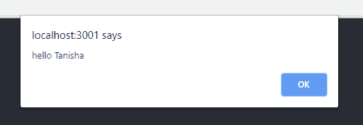
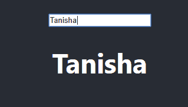

# 无控制与受控输入的反应

> 原文:[https://www . geesforgeks . org/react-js-uncontrolled-vs-controlled-inputs/](https://www.geeksforgeeks.org/react-js-uncontrolled-vs-controlled-inputs/)

在 HTML 中，像<input>、<textarea>、<select>等表单元素通常会维护自己的状态，并根据用户输入进行更新。在 React 中，一个可变的状态通常保存在组件的状态属性中。<br/>在反应表单中，根据您的选择，输入值可以有两种类型:非受控值和受控值。<br/> <strong>不受控输入:</strong>输入值不受控时，不存在任何状态的更新或改变。它保持自己的内部状态，这基本上意味着它会记住您在字段中键入的内容。该值可以通过在需要使用时使用 ref 关键字提取来利用。在不受控制的输入中，你提交的值就是你得到的值。<br/></select></textarea>

现在，打开您的 react 项目并编辑 src 文件夹中的 **index.js** 文件:

**src index.js:**

## java 描述语言

```jsx
import React from 'react';
import ReactDOM from 'react-dom';
import NameForm from './NameForm';

ReactDOM.render(
  <React.StrictMode>
    <NameForm />
  </React.StrictMode>,
  document.getElementById('root')
);
```

在 react 项目中创建一个组件名:

现在，打开您的 react 项目，在 src 文件夹中编辑 **NameForm.js** 文件:

**src 名称表单:**

## java 描述语言

```jsx
import React,{Component} from 'react';

class NameForm extends  React.Component {
    handleClick = () => {
      const name = this._name.value;
      alert('Hello ', name);
    }

    render() {
      return (
        <div>
          <input type="text" ref=
                {inputValue => this._name = inputValue}

            placeholder="Enter your name" />
            <button onClick={this.handleClick}>
                Done
            </button>
        </div>
     );
    }
  }

export default NameForm;
```

**输入:**谷莎
**输出:**你好谷莎(显示在提醒框上)



**受控输入:**在受控输入中，字段中随时都会发生某种变化和修改，输入的每一个字符，甚至退格之类的东西都会被视为变化。输入字段的当前值将是类组件的一个属性(通常它将处于通过使用 this.state.varName 引用的状态)，因为它们不维护它们的内部状态。还有一个回调函数(如 onChange、onClick 等)，它是处理输入字段中发生的变化(值的变化)所必需的，这使得它们是可控的。
现在，打开你的 react 项目，编辑 src 文件夹中的 **NameForm.js** 文件:
src **NameForm.js:**

## java 描述语言

```jsx
import React,{Component} from 'react';

class NameForm extends React.Component {
    constructor(props) {
        super(props);
        this.state = {
            name: '',
        };
    }

    handleNameChange = (event) => {
        this.setState({ name: event.target.value });
    };

    render() {
        return (
            <div>
                <input type="text" onChange=
                        {this.handleNameChange}
                        placeholder="Enter your name" />
                <h1>{this.state.name}</h1>
            </div>
        );
    }
}

export default NameForm;
```

**输入:**塔尼莎
**输出:**塔尼莎(用户键入时在屏幕上逐字母显示)



**哪个更好？**
很明显，受控和非受控表单域都有各自的好处。根据情况需要，您可能需要同时使用这两种方法或其中一种。如果您正在制作一个很少或没有用户界面反馈的简单表单，并且不需要即时验证(这意味着您只需要在提交时验证和/或需要值)，那么您应该使用带有引用的不受控制的输入。它将把真理的来源保存在 DOM 中，使它更快，需要更少的代码。如果您需要更多的用户界面反馈，并考虑到特定输入字段中的每一个微小变化，请选择受控输入。