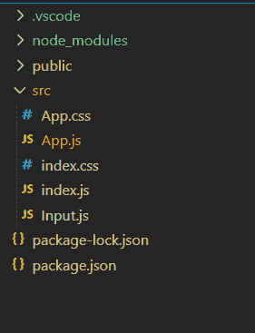
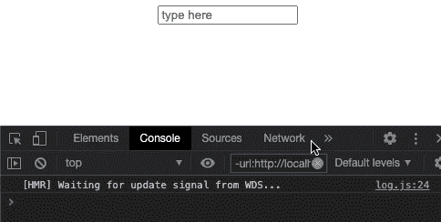

# react . js useprivativehandle 附加挂钩

> 原文:[https://www . geeksforgeeks . org/react-js-useimporthandle-additional-hook/](https://www.geeksforgeeks.org/react-js-useimperativehandle-additional-hook/)

**usePrecisionHandle**钩子在 useRef 钩子的类似阶段工作，但是它只允许我们修改将与引用对象一起传递的实例，该引用对象提供对任何 DOM 元素的引用。虽然这种钩子很少使用，但是它有一些最高级的功能。

**语法:**

```jsx
useImperativeHandle(ref, createHandle, [deps])
```

**创建反应应用程序:**

*   **步骤 1:** 使用以下命令创建一个 React 应用程序。

    ```jsx
    npx create-react-app functiondemo
    ```

*   **步骤 2:** 创建项目文件夹(即 functiondemo)后，使用以下命令移动到该文件夹。

    ```jsx
    cd functiondemo
    ```

**项目结构:**如下图。



项目结构

**示例:**在本例中，我们将构建一个自定义输入按钮，该按钮在聚焦时执行自定义用户定义的操作。这是我们将在 *App.js* 文件中导入的自定义输入字段。

## Input.js

```jsx
import React, { useRef, useImperativeHandle, forwardRef } from 'react';

function Input(props, ref) {
  const btn = useRef();
  useImperativeHandle(ref, () => ({
    focus: () => {
      console.log('Input is in focus');
    },
  }));
  return <input ref={btn} {...props} placeholder="type here" />;
}

export default forwardRef(Input);
```

## App.js

```jsx
import React, { useRef } from 'react';
import Input from './Input';

const App = () => {
  const inputRef = useRef(null);
  return (
    <div>
      <Input onFocus={() => inputRef.current.focus()} 
      ref={inputRef} />
    </div>
  );
};

export default App;
```

**运行应用程序的步骤:**从项目的根目录使用以下命令运行应用程序:

```jsx
npm start
```

**输出:**



**参考:**[https://reactjs . org/docs/hooks-Reference . html # useimporthandle](https://reactjs.org/docs/hooks-reference.html#useimperativehandle)