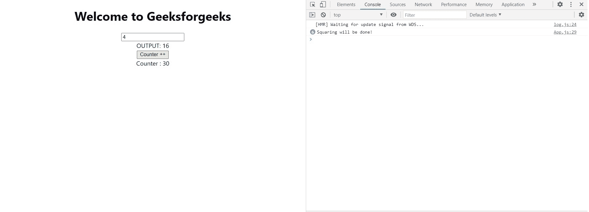

# 反应 JS 使用备忘录挂钩

> 原文:[https://www.geeksforgeeks.org/react-js-usememo-hook/](https://www.geeksforgeeks.org/react-js-usememo-hook/)

useMemo 是在 react 的函数组件中使用的一个钩子，它返回一个 memoized 值。在计算机科学中，记忆是一个通常使用的概念，当我们下次返回缓存结果时，不需要用给定的参数重新计算函数。记忆函数记住给定输入集的输出结果。例如，如果有一个函数将两个数字相加，并且我们第一次将参数设置为 1 和 2，则该函数将这两个数字相加并返回 3，但是如果相同的输入再次出现，则我们将返回缓存的值，即 3，并且不再使用 add 函数进行计算。在 react 中，我们也使用这个概念，只要在 React 组件中，状态和道具不改变组件，并且组件不重新渲染，它就会显示相同的输出。useMemo 钩子用于提高我们的 React 应用程序的性能。

**语法:**

```
const memoizedValue = useMemo(functionThatReturnsValue, 
                                   arrayDepencies)

```

**示例**:当我们不使用 useMemo Hook 的时候。

## java 描述语言

```
import React, {useState} from 'react';

function App() {
  const [number, setNumber] = useState(0)
  const squaredNum =  squareNum(number);
  const [counter, setCounter] = useState(0);

 // Change the state to the input
  const onChangeHandler = (e) => {
    setNumber(e.target.value);
  }

  // Increases the counter by 1
  const counterHander = () => {
    setCounter(counter + 1);
  }
  return (
    <div className="App">
      <h1>Welcome to Geeksforgeeks</h1>
      <input type="number" placeholder="Enter a number" 
        value={number} onChange={onChangeHandler}>
      </input>

      <div>OUTPUT: {squaredNum}</div>
      <button onClick= {counterHander}>Counter ++</button>
      <div>Counter : {counter}</div>
    </div>
  );
}

// function to square the value
function squareNum(number){
  console.log("Squaring will be done!");
  return Math.pow(number, 2);
}

export default App;
```

**输出:**在上面的例子中，我们有一个 App 组件，这个组件做两件事，一是对给定的输入求一个数字的平方，然后递增计数器。我们这里有两个状态，数字和计数器，只要任何一个状态改变，组件就会重新呈现。例如，如果我们改变函数平方数运行的数字的输入值，如果再次增加计数器，函数平方数运行。我们可以在控制台上看到这个。


在这种情况下，我们可以看到，即使我们更改了一次输入数字，但是多次单击了-increment counter，每当我们多次单击 increment counter 按钮时，我们的函数 squareNum 都会被执行。这是因为每当我们更改计数器的状态时，应用程序组件都会重新呈现。

现在让我们使用 useMemo 钩子来解决这个问题。

**示例:**当我们使用 useMemo Hook 时

## java 描述语言

```
import React, {useState} from 'react';

function App() {
  const [number, setNumber] = useState(0)
  // Using useMemo
  const squaredNum = useMemo(()=> {
    return squareNum(number);
  }, [number])
  const [counter, setCounter] = useState(0);

 // Change the state to the input
  const onChangeHandler = (e) => {
    setNumber(e.target.value);
  }

  // Increases the counter by 1
  const counterHander = () => {
    setCounter(counter + 1);
  }
  return (
    <div className="App">
      <h1>Welcome to Geeksforgeeks</h1>
      <input type="number" placeholder="Enter a number"
          value={number} onChange={onChangeHandler}>
      </input>

      <div>OUTPUT: {squaredNum}</div>
      <button onClick= {counterHander}>Counter ++</button>
      <div>Counter : {counter}</div>
    </div>
  );
}

// function to square the value
function squareNum(number){
  console.log("Squaring will be done!");
  return Math.pow(number, 2);
}

export default App;
```

**输出:**现在在上面的例子中，我们使用了用户 memo 钩子，这里返回值的函数，即 squareNum 在 useMemo 内部和数组依赖项内部传递，我们使用了数字，因为 squareNum 只有在数字改变时才会运行。如果我们增加计数器，并且输入字段中的数字保持不变，平方数就不会再次运行。让我们看看下面的输出。



现在，我们可以在控制台中看到，squareNum 仅在输入框发生变化时运行，而不是在单击增量计数器的按钮时运行。

**注:**死记硬背从来不是免费的，我们是在用空间换时间。