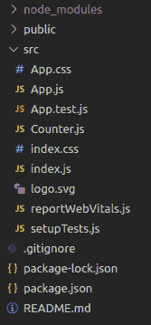

# 无 ES6 的 React.js】

> 原文:[https://www.geeksforgeeks.org/react-js-without-es6/](https://www.geeksforgeeks.org/react-js-without-es6/)

Reactjs 是有史以来最好的前端库。它由脸书制造，在前端本身执行多项任务。ES6 是 javascript 的标准化，使代码更易读、更易访问。

如果我们在 react 中不使用 ES6，那么还有一种替代方法可以执行。我们用**创造-反应-类**代替 ES6。让我们看看 ES6 和 create-react-class 方法之间的一些变化。

关于 ES6 的详细文章，请参考:[**ES6 简介**](https://www.geeksforgeeks.org/introduction-to-es6/)

**创建反应应用程序并安装模块:**

*   **步骤 1:** 使用以下命令创建一个反应应用程序。

    ```
    npx create-react-app foldername
    ```

*   **步骤 2:** 创建项目文件夹(即文件夹名)后，使用以下命令移动到该文件夹。

    ```
    cd foldername
    ```

*   **步骤 3:** 创建 ReactJS 应用程序后，使用以下命令安装 create-react 类模块。

    ```
    npm install create-react-class
    ```

**项目结构:**



**1。使用创建-反应-类:**它被用作默认的基于类的组件的替代。

*   **ES6 实施:**

    ## App.js

    ```
    import React from 'react'
    import "./App.css"

    // Make a App class component using ES6
    class App extends React.Component { 
      render() {
        return <h1>Hello Welcome to, GeeksforGeeks</h1>;
      }
    }

    export default App;
    ```

*   **创建-反应-类模块:**

    ## App.js

    ```
    import React from 'react'
    import "./App.css"

    // Created a variable createReactClass which 
    // holds a main create-react-class molule 
    // with require module
    var createReactClass = require('create-react-class');

    // App  takes a variable and renders 
    // the output function for showing
    // results in screen
    var App = createReactClass({

      render: function () {
        return <h1>Hello Welcome to, GeeksforGeeks</h1>;
      }
    });

    export default App;
    ```

**输出:**


**2。在 React 中声明默认道具:**使用 ES6，默认道具可以作为 reactjs 类组件的属性。

*   **ES6 实施:**

    ## App.js

    ```
    import React from 'react'
    import "./App.css"

    class App extends React.Component {
      render() {
        // we set the default value 
        // of props and called with the help of es6 
        return <h1>Hello Welcome to, {this.props.name}</h1>;
      }
    }

    // Assigned the default value of props.
    App.defaultProps = {
      name: 'GeeksforGeeks'
    }

    export default App;
    ```

*   **创建-反应-类模块:**

    ## java 描述语言

    ```
    import React from 'react'
    import "./App.css"

    var createReactClass = require('create-react-class');
    var App = createReactClass({

      // We added this getDefaultProps 
      // function parameter as a passed object 
      // for getting props values.
      // We return all the name with return function
      getDefaultProps: function () {
        return {
          name: "GeeksforGeeks"
        }

      },
      render: function () {
        // We call the name from here!
        return <h1>Hello Welcome to, {this.props.name}</h1>;
      }
    });

    export default App;
    ```

**输出:**


**3。设置初始状态:**与声明默认道具相同，设置初始状态相同。为了设置初始状态，我们需要在构造器中分配**这个. state** 。为此制作**计数器. js** 文件。

*   **ES6 实施:**

    ## Counter.js

    ```
    import React from 'react'

    class Counter extends React.Component {
        constructor(props) {
            super(props);
            // setting the initial count
            this.state = { count: props.initialCount }; 
        }

        handleClick = () => {
            // for increasing by 1 with on click 
            this.setState({ count: this.state.count + 1 }); 
        }

        render() {
            return (
                <button onClick={this.handleClick}>
                     {this.state.count}
                </button>
            );
        }

    }

    export default Counter;
    ```