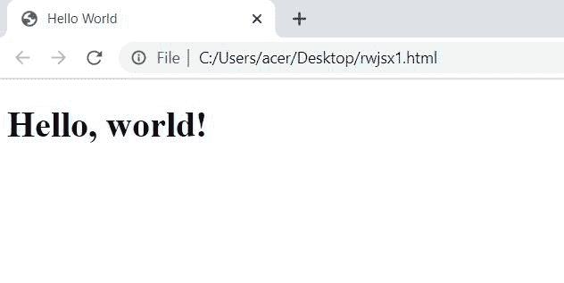
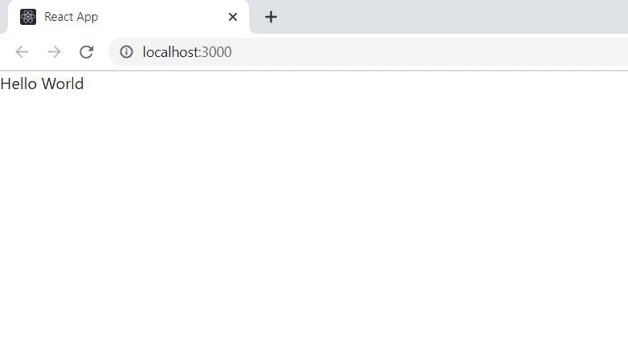

# 无 JSX 反应堆

> 原文:[https://www.geeksforgeeks.org/react-js-without-jsx/](https://www.geeksforgeeks.org/react-js-without-jsx/)

**[JSX](https://www.geeksforgeeks.org/reactjs-introduction-jsx/) :** 考虑以下代码片段，

```jsx
const sample = <h2>Greetings</h2>;
```

上面的代码片段看起来有点像 HTML，它也使用了一个类似 JavaScript 的变量，但既不是 HTML 也不是 JavaScript，它是 JSX。JSX 基本上是常规 JavaScript 的语法扩展，用于创建 React 元素。这些元素随后被渲染到反应 DOM。每个 JSX 元素都是为了简单地使用 React，并且调用 React.createElement(组件、道具、…子元素)的工作量更少。所以，用 JSX 做的任何事情也可以用普通的 JavaScript 来完成。

大多数人使用 JSX 来作出反应，但这需要巴别尔将 ES6 代码转换成与浏览器兼容的代码。这意味着我们需要一个类似 webpack 的东西。如果我们不使用 JSX，我们就不用担心这个。

**在以 JSX 为重点的反应应用上的无 JSX 方法:**对于你的中型或大型项目，最好坚持 JSX。了解幕后发生的事情仍然有帮助。对于较小的 React 项目，您不想添加复杂的构建工作流，或者对于多页应用程序，您可以考虑无 JSX 版本。

**实施例 1:** 使用无 JSX 反应使用 CDN(无节点)。下面是一个简单的 Html 代码打印*你好世界*使用无 JSX 反应。

## index.html

```jsx
<!DOCTYPE html>
<html>
  <head>
    <meta charset="UTF-8" />
    <script src=
"https://unpkg.com/react@16/umd/react.development.js">
    </script>
    <script src=
"https://unpkg.com/react-dom@16/umd/react-dom.development.js">
    </script>
  </head>
  <body>
    <div id="root"></div>
    <script type="text/javascript">
      var e = React.createElement;
      ReactDOM.render(
        e('h1', null, 'Hello, world!'),
        document.getElementById('root')
      );
    </script>
  </body>
</html>
```

**输出:**



上述程序的输出

**实施例 2:** 在应用中使用无 JSX 反应。

**创建反应应用程序:**

*   **步骤 1:** 使用以下命令创建一个反应应用程序:

    ```jsx
    npx create-react-app rwjsx
    ```

*   **步骤 2:** 创建项目文件夹，即 *rwjsx* 后，使用以下命令移动到该文件夹:

    ```jsx
    cd rwjsx
    ```

**项目结构:**如下图。


***项目结构***

现在在所有导入语句后，在**文件夹中的 **index.js** 文件中写下以下代码。**

## **index.js**

```jsx
import React from 'react';
import ReactDOM from 'react-dom';

class Hello extends React.Component {
  render() {
    return React.createElement('div', null, `Hello ${this.props.toWhat}`);
  }
}

ReactDOM.render(
  React.createElement(Hello, {toWhat: 'World'}, null),
  document.getElementById('root')
);
```

****运行应用程序的步骤:**从项目的根目录使用以下命令运行应用程序:**

```jsx
npm start
```

****输出:**现在打开浏览器，转到***http://localhost:3000/***，会看到如下输出:**

****