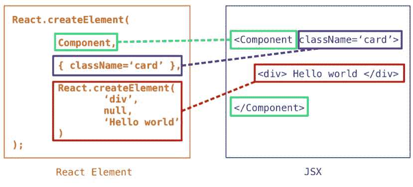

# 深度反应 JSX

> 原文:[https://www.geeksforgeeks.org/react-jsx-in-depth/](https://www.geeksforgeeks.org/react-jsx-in-depth/)

正如我们在本文 [React.js(简介和工作)](https://www.geeksforgeeks.org/react-js-introduction-working/)中看到的，React 是如何工作的，将我们的应用程序分解成更小的可重用部分，我们称之为 ***组件*** 。这些组件是树状的 HTML 或组件结构。在那篇文章中，我们已经看到了如何在 react 中使用 ***创建元素*** 。但是，如果我们必须使用 React 的 createElement 方法来创建元素，那么对于演示目的或小型应用程序来说，这很好，但对于大型应用程序来说就不行了。你不应该用它。

React.createElement 可以为小应用程序或演示目的创建元素，但不能为大的畅销应用程序创建元素，因为它很难维护或调试。我们必须每次都调用 React.createElement 方法来创建 React element，即使它只是一个没有属性的 span 标记。

您可以使用 React.createElement 方法构建整个应用程序(我不建议这样做)。

如果我们不应该使用 **createElement** 使用 JSX。它是 JavaScript 和 XML。这是一个 JavaScript 扩展，允许我们在 JS 代码中使用基于标签的样式语法来定义 React 元素。这有多酷？

有时新开发人员会把 JSX 和 HTML 搞混，因为它们看起来很熟悉。JSX 只是创造反应元素的另一种方式。react 团队创建了 JSX，使其更像 HTML 和 XML 一样可读。这样我们就不用用 **createElement** 方法手动创建 React 元素了。假设您想要创建一个具有类 btn 的按钮，btn-primary。

## java 描述语言

```jsx
<button className="btn btn-primary"> save </button>
```

这是 JSX 语法看起来像 HTML，但有一些小的区别，我们将在本文后面讨论。JSX 也从事零部件工作，

## java 描述语言

```jsx
<Component className="card">
    <div>Hello world</div>
</Component>
```

下图展示了如何从 ***合成 React Element . create Element***方法和 ***JSX。***



从上面的图片中，你可以清楚地看到，我们可以很容易地用 JSX 创建一个 React 元素。可读性也是 React 团队实现 JSX 的简单性的主要原因。

浏览器不懂 JSX 语法，你必须把你的 JSX 代码编译成 JavaScript 代码。为此，你可以使用巴别塔。您可以使用脚本标签中的 CDN 链接在您的 HTML 文件中添加巴贝尔。我们必须从外部指定巴贝尔应该从哪里传输。为此，我们必须在脚本标签中添加类型属性(text/babel)。

## 超文本标记语言

```jsx
<body>
    // Root element of React code
    <div id="root"></div>    

    <script crossorigin src=
"https://unpkg.com/react@17/umd/react.development.js">
    </script>
    <script crossorigin src=
"https://unpkg.com/react-dom@17/umd/react-dom.development.js">
    </script>

    // Babel
    <script src=
"https://unpkg.com/@babel/standalone/babel.min.js">
    </script>

    // Our JS code
    <script src="./main.js" type="text/babel"></script>

</body>
```