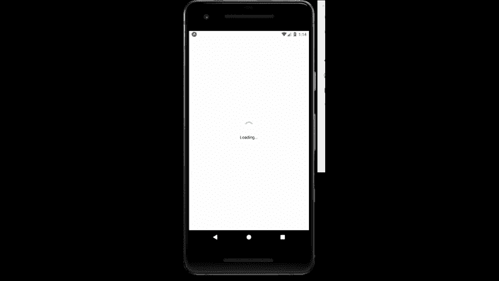

# 反应天然活性指示剂成分

> 原文:[https://www . geesforgeks . org/react-native-activityindicator-component/](https://www.geeksforgeeks.org/react-native-activityindicator-component/)

在本文中，我们将看到如何在 react-native 中创建一个 ActivityIndicator。为此，我们将使用 ActivityIndicator 组件。它用于显示圆形装载指示器。

**语法:**

```jsx
<ActivityIndicator />
```

**活动中的道具指示器:**

*   **动画:**如果为真，它将显示指示器，如果为假，它将隐藏指示器。
*   **颜色:**微调器的前景色。
*   **hidewhenstopped:**它控制指示器在不动画时是否应该隐藏。它仅适用于 ios 设备。
*   **尺寸:**指示器的尺寸。

**现在我们从实现开始:**

*   **步骤 1:** 打开终端，通过以下命令安装 expo-cli。

    ```jsx
    npm install -g expo-cli
    ```

*   **步骤 2:** 现在通过以下命令创建一个项目。

    ```jsx
    expo init myapp
    ```

*   **第三步:**现在进入你的项目文件夹，即 myapp

    ```jsx
    cd myapp
    ```

**项目结构:**


**示例:**现在让我们实现 ActivityIndicator。这里我们创建了一个活动指示器。

## App.js

```jsx
import React from 'react';
import {View, StyleSheet, Text , 
        ActivityIndicator} from 'react-native';

export default function App() {
  return (
    <View style={styles.container}>
      <ActivityIndicator size="large" color="lightgreen"/>
      <Text style={styles.text}>Loading...</Text>
    </View>
  );
}

const styles = StyleSheet.create({
  container: {
    flex: 1,
    justifyContent: 'center',
    alignItems: 'center',
  },
  text : {
    marginTop : 10,
  }

});
```

使用以下命令启动服务器。

```jsx
npm run android
```

**输出:**如果你的模拟器没有自动打开，那么你需要手动打开。首先，去你的安卓工作室运行模拟器。现在再次启动服务器。



**参考:**T2】https://reactnative.dev/docs/activityindicator