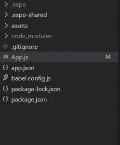
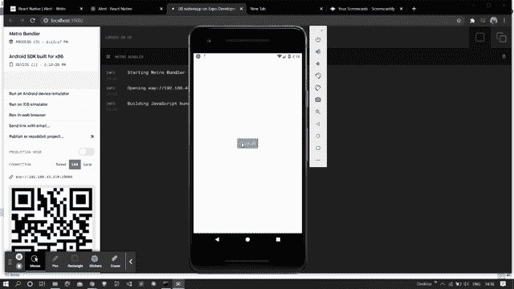

# 反应原生警报 API

> 原文:[https://www.geeksforgeeks.org/react-native-alert-api/](https://www.geeksforgeeks.org/react-native-alert-api/)

在本文中，我们将看到如何在 [react-native](https://www.geeksforgeeks.org/introduction-react-native/) 中创建警报。为此，我们将使用反应本地警报应用编程接口。基本上就是弹出一个小窗口让用户选择。

这是一个使用警报方法来显示警报对话框的应用编程接口。该对话框可以有三个按钮，分别是正、负和中性，用于执行不同的操作。

**语法:**

```jsx
Alert.alert(
      "Alert Title",
      "Alert Msg",
      [
        {
          text: "Cancel"
        },
        { 
          text: "OK"
        }
      ]
);
```

反应本机警报应用编程接口接受两种方法，如下所述。

*   **alert():** 此方法用于通过弹出窗口创建和显示消息。
*   **提示():**此方法用于创建并显示提示，以提醒的形式输入一些文本。

**报警方式参数:**

*   **标题:**这是显示为对话框标题的必需参数。
*   **消息:**是显示对话框消息的可选参数。
*   **按钮:**也是一个可选参数，显示对话框上的按钮。
*   **选项:**也是可选参数，只有安卓才有。

**提示方式参数:**

*   **标题:**这是显示为对话框标题的必需参数。
*   **消息:**是显示对话框消息的可选参数。
*   **调用后退按钮:**该参数可以作为函数或按钮传递，如果作为函数传递，当用户同意该条件时，将使用提示值调用该参数。如果它作为按钮传递，那么它将基于数组内容进行配置
*   **类型:**该参数配置文本输入。
*   **默认值:**该参数是定义文本输入中默认文本的字符串。
*   **键盘类型:**此参数是一个字符串，用于定义第一个文本字段的键盘类型(如果存在)。

**现在我们从实现开始:**

*   **步骤 1:** 打开终端，通过以下命令安装 expo-cli。

    ```jsx
    npm install -g expo-cli
    ```

*   **步骤 2:** 现在通过以下命令创建一个项目。

    ```jsx
    expo init myapp
    ```

*   **第三步:**现在进入你的项目文件夹，即 myapp

    ```jsx
    cd myapp
    ```

**项目结构:**



**示例:**现在让我们实现警报功能。这里我们创建了一个按钮，当有人点击该按钮时，会弹出一个警告。

## App.js

```jsx
import React from 'react';
import { StyleSheet,
         Text, 
          View,
          Button,
          Alert
        } from 'react-native';

export default function App() {

  // Alert function
  const alert = ()=>{
    Alert.alert(
      "GeeksforGeeks",
      "How are you!",
      [
        {
          text: "Cancel",
        },
        {
          text: "OK",
        }
      ]
    );
  }

  return (
    <View style={styles.container}>
      <Button title={"Click me"} onPress={alert}/>
    </View>
  );
}

const styles = StyleSheet.create({
  container: {
    flex: 1,
    backgroundColor: '#fff',
    alignItems: 'center',
    justifyContent: 'center',
  },
});
```

使用以下命令启动服务器。

```jsx
npm run android
```

**输出:**如果你的模拟器没有自动打开，那么你需要手动打开。首先，去你的安卓工作室运行模拟器。现在再次启动服务器。**T3】**



**参考:**T2**https://reactnative.dev/docs/alert**T5】