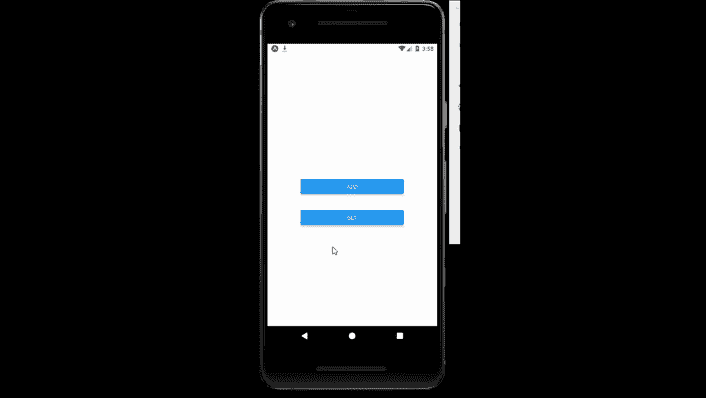

# 反应原生异步存储组件

> 原文:[https://www . geesforgeks . org/react-native-async storage-component/](https://www.geeksforgeeks.org/react-native-asyncstorage-component/)

以下方法介绍了如何在[反应原生](https://www.geeksforgeeks.org/introduction-react-native/)中使用异步存储。为此，我们将使用异步存储组件。AsyncStorage 是一个未加密、异步、持久的键值存储系统，对应用程序是全局的。

**语法:**

```
AsyncStorage.method();
```

**异步存储中的方法:**

*   **getItem():** 它为一个键获取一个项目。
*   **setItem():** 它为特定的键设置一个项。
*   **removeItem():** 它为一个键移除一个项目。
*   **mergeItem():** 它将现有键值与输入值合并。
*   **清除():**清除所有客户端、库等的所有异步存储。
*   **getAllKeys():** 它会获取你的应用已知的所有密钥。
*   **flushegetrequests():**它使用单个批处理调用来刷新任何挂起的请求，以获取数据。
*   **multiGet():** 这允许您在给定键输入数组的情况下批量获取项目。
*   **multiSet():** 它将其用作存储多个键值对的批处理操作。
*   **multiRemove():** 它从键数组中移除所有键。
*   **multiMerge():** 这是一个批处理操作，用于合并给定键集的现有值和新值。

**现在我们从实现开始:**

*   **步骤 1:** 打开终端，通过以下命令安装 expo-cli。

    ```
    npm install -g expo-cli
    ```

*   **步骤 2:** 现在通过以下命令创建一个项目。

    ```
    expo init myapp
    ```

*   **第三步:**现在进入你的项目文件夹，即 myapp

    ```
    cd myapp
    ```

**项目结构:**如下图。


对于 AsyncStorage，我们在 react-native 中有一个 AsyncStorage 组件，但是这个组件现在已经被**弃用了**，所以作为替代，我们将使用一个名为*@ react-native-async-storage/async-storage*的外部包。使用以下命令安装该软件包。

```
npm install @react-native-async-storage/async-storage
```

**示例:**现在让我们实现 AsyncStorage。这里我们创建了两个按钮第一个按钮设置值，第二个按钮获取值。

**App.js**

## App.js

```
import React , {useState} from 'react';
import { StyleSheet, Text, View , Button } from 'react-native';
import AsyncStorage from '@react-native-async-storage/async-storage';
export default function App() {
  const [data , setdata] = useState("");
  const add = async ()=>{
    try {
      await AsyncStorage.setItem('gfg', "GeeksforGeeks")
    }
    catch (e){
      console.error(e);
    }
  }

  const get = async () => {
    try {
      const value = await AsyncStorage.getItem('gfg')
      if(value !== null) {
          setdata(value);
      }
    }  catch (e){
      console.error(e);
    }
  }
  return (
    <View style={styles.container}>
        <Text style={styles.text}>{data}</Text>
        <View style={styles.button} >
          <Button
            title={"add"}
            onPress={add}
          />
        </View>
        <View style={styles.button} >
          <Button
            title={"get"}
            onPress={get}
          />
        </View>
</View>
  );
}

const styles = StyleSheet.create({
  container: {
    flex: 1,
    backgroundColor: '#fff',
    alignItems: 'center',
    justifyContent: 'center',
  },
  text : {
    fontSize : 40,
    marginBottom : 30
  },
  button : {
    margin:20,
    width:250
  }
});
```

使用以下命令启动服务器。

```
npm run android
```

**输出:**如果你的模拟器没有自动打开，那么你需要手动打开。首先，去你的安卓工作室运行模拟器。现在再次启动服务器。



**参考:**T2】https://reactnative.dev/docs/asyncstorage