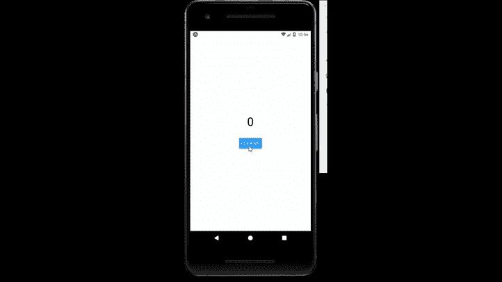

# 反应原生按钮组件

> 原文:[https://www . geesforgeks . org/react-native-button-component/](https://www.geeksforgeeks.org/react-native-button-component/)

以下方法介绍了如何使用[中的按钮进行反应-原生](https://www.geeksforgeeks.org/introduction-react-native/)。为此，我们将使用按钮组件。它基本上是一个可点击的组件，用于在用户点击时执行一些操作。

**语法:**

```jsx
<Button
 onPress={}
 title="Button"
 color="#841584"
/>
```

**按钮中的道具:**

*   **onPress:** 当用户点击按钮时调用。
*   **标题:**显示在按钮内部的文本。
*   **可访问性标签:**显示失明可访问性特征的文本。
*   **颜色:**用于设置按钮的颜色。
*   **禁用:**如果为真，则用户无法按下按钮。
*   **hasvpreferredfocus:**电视首选对焦，仅适用于电视。
*   **nextFocusDown:** 指定用户向下导航时接收焦点的下一个视图。
*   **nextFocusForward:** 指定当用户向前导航时接收焦点的下一个视图。
*   **nextFocusLeft:** 指定用户向左导航时接收焦点的下一个视图。
*   **nextFocusRight:** 指定当用户向右导航时接收焦点的下一个视图。
*   **nextFocusUp:** 指定用户向上导航时接收焦点的下一个视图。
*   **testID:** 用于在端到端测试中定位该视图。
*   **触摸声音禁用:**如果为真，触摸时不播放系统声音。

**现在我们从实现开始:**

*   **步骤 1:** 打开终端，通过以下命令安装 expo-cli。

    ```jsx
    npm install -g expo-cli
    ```

*   **步骤 2:** 现在通过以下命令创建一个项目。

    ```jsx
    expo init myapp
    ```

*   **第三步:**现在进入你的项目文件夹，即 myapp

    ```jsx
    cd myapp
    ```

**项目结构:**如下图。


**示例:**现在让我们实现按钮。这里我们创建了一个按钮，当有人点击该按钮时，计数将会改变。

**App.js**

## App.js

```jsx
import React , {useState} from 'react';
import { StyleSheet, Text, View , Button } from 'react-native';

export default function App() {
  const [count , setcount] = useState(0);
  const changeCount = () => {
    setcount(count + 1);
  }
  return (
    <View style={styles.container}>
        <Text style={styles.text}>{count}</Text>
        <Button
          title={"Click Me"}
          onPress={changeCount}
        />
    </View>
  );
}

const styles = StyleSheet.create({
  container: {
    flex: 1,
    backgroundColor: '#fff',
    alignItems: 'center',
    justifyContent: 'center',
  },
  text : {
    fontSize : 40,
    marginBottom : 30
  }
});
```

使用以下命令启动服务器。

```jsx
npm run android
```

**输出:**如果你的模拟器没有自动打开，那么你需要手动打开。首先，去你的安卓工作室运行模拟器。现在再次启动服务器。



**参考:**T2】https://reactnative.dev/docs/button