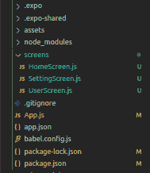

# 反应原生配置标题栏

> 原文:[https://www . geesforgeks . org/react-native-configuration-header-bar/](https://www.geeksforgeeks.org/react-native-configuring-header-bar/)

要配置 React Native 应用程序的标题栏，请使用导航选项。导航选项是屏幕组件的静态属性，它是一个对象或功能**。**

**标题栏道具**

*   **标题标题:**用于设置活动屏幕的标题。
*   **页眉样式:**用于给标题栏添加样式。
*   **backgroundColor:** 用于更改标题栏的背景颜色。
*   **表头颜色:**用于更改表头标题的颜色。
*   **headerTitleStyle:** 用于给标题添加自定义样式。
*   **字体粗细:**用于设置页眉标题的字体样式。
*   **headerRight:** 用于在标题栏右侧添加项目。
*   **页眉:用于在标题栏左侧添加项目。**

**实现:**现在我们来看看如何配置标题栏:

*   **步骤 1:** 打开终端，通过以下命令安装 expo-cli。

    ```jsx
    npm install -g expo-cli
    ```

*   **步骤 2:** 现在通过以下命令创建一个项目。

    ```jsx
    expo init header-bar
    ```

*   **步骤 3:** 现在进入你的项目文件夹，即标题栏

    ```jsx
    cd header-bar
    ```

*   **步骤 4:** 使用以下命令安装所需的软件包:

    > npm 安装-保存反应-导航-材料-底部-选项卡反应-本地-纸张反应-本地-矢量-图标

**项目结构:**项目目录应该如下所示:



**示例:**在我们的示例中，我们将了解如何设置标题栏的样式，如何向其添加标题按钮/图标，并学习如何从一个屏幕动态发送数据并将其作为标题显示在另一个屏幕上。

## App.js

```jsx
import React from "react";
import { createAppContainer } from "react-navigation";
import { createStackNavigator } from "react-navigation-stack";

import HomeScreen from "./screens/HomeScreen";
import UserScreen from "./screens/UserScreen";
import SettingScreen from "./screens/SettingScreen";

const AppNavigator = createStackNavigator(
  {
    Home: HomeScreen,
    User: UserScreen,
    Setting: SettingScreen,
  },
  {
    defaultNavigationOptions: {
      headerStyle: {
        backgroundColor: "#006600",
      },
      headerTitleStyle: {
        fontWeight: "bold",
        color: "#FFF",
      },
      headerTintColor: "#FFF",
    },
  },
  {
    initialRouteName: "Home",
  }
);

const Navigator = createAppContainer(AppNavigator);

export default function App() {
  return (
    <Navigator>
      <HomeScreen />
    </Navigator>
  );
}
```

**HomeScreen.js:** 注意导航选项。在这里，我们在标题栏中配置了一个标题按钮组件，它将我们带到设置屏幕。此外，请注意，当我们单击“转到用户屏幕”按钮时，我们会发送用户输入。

## HomeScreen.js

```jsx
import React, { useState } from "react";
import { Text, View, TextInput, Button } from "react-native";
import { Ionicons } from "@expo/vector-icons";
import {
  Item,
  HeaderButton,
  HeaderButtons,
} from "react-navigation-header-buttons";

const Home = (props) => {
  const [input, setInput] = useState("");
  return (
    <View style={{ flex: 1, alignItems: "center", justifyContent: "center" }}>
      <Text style={{ color: "#006600", fontSize: 40 }}>Home Screen!</Text>
      <Ionicons name="ios-home" size={80} color="#006600" />
      <TextInput
        placeholder="Enter your name"
        value={input}
        onChangeText={(value) => setInput(value)}
      />
      <Button
        title="Go to User Screen"
        color="#006600"
        onPress={() => props.navigation.navigate("User", { username: input })}
      />
    </View>
  );
};

const HeaderButtonComponent = (props) => (
  <HeaderButton
    IconComponent={Ionicons}
    iconSize={23}
    color="#FFF"
    {...props}
  />
);

Home.navigationOptions = (navData) => {
  return {
    headerTitle: "Home",
    headerRight: () => (
      <HeaderButtons HeaderButtonComponent={HeaderButtonComponent}>
        <Item
          title="Setting"
          iconName="ios-settings-outline"
          onPress={() => navData.navigation.navigate("Setting")}
        />
      </HeaderButtons>
    ),
  };
};

export default Home;
```

**UserScreen.js:** 这里我们接收用户输入，我们通过主屏幕将它设置为输出标题栏中的标题。

## UserScreen.js

```jsx
import React from "react";
import { Text, View } from "react-native";
import { Ionicons } from "@expo/vector-icons";

const User = () => {
  return (
    <View style={{ flex: 1, alignItems: "center",
                   justifyContent: "center" }}>
      <Text style={{ color: "#006600", fontSize: 40 }}>
        User Screen!
      </Text>
      <Ionicons name="ios-person-circle-outline" 
                size={80} color="#006600" />
    </View>
  );
};

User.navigationOptions = (navData) => {
  return {
    headerTitle: navData.navigation.getParam("username"),
  };
};

export default User;
```

## SettingScreen.js

```jsx
import React from "react";
import { Text, View } from "react-native";
import { Ionicons } from "@expo/vector-icons";

const Settings = () => {
  return (
    <View style={{ flex: 1, alignItems: "center", justifyContent: "center" }}>
      <Text style={{ color: "#006600", fontSize: 40 }}>Settings Screen!</Text>
      <Ionicons name="ios-settings-outline" size={80} color="#006600" />
    </View>
  );
};

export default Settings;
```

**运行应用程序:**使用以下命令启动服务器。

```jsx
expo start
```

**输出:**注意当你点击单个标签时，会有轻微的动画。这是由物料底部标签导航器自动提供的。


**参考:**T2】https://reactnavigation.org/docs/headers/