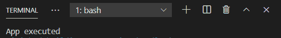
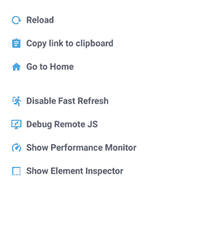
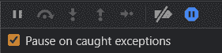

# 反应原生调试

> 原文:[https://www.geeksforgeeks.org/react-native-debugging/](https://www.geeksforgeeks.org/react-native-debugging/)

**调试**对于构建应用程序和消除错误非常重要。良好的调试技术知识有助于更快更有效地开发软件。

这里我们将讨论 React Native 中的一些调试技术。我们将使用 *expo-cli* 来开发、运行和调试我们的应用程序，这是构建 React Native 应用程序最简单、最快的方法之一。

以下是 React Native 中通常使用的调试技术:

1.  记录
2.  在 Chrome 浏览器中调试
3.  Visual Studio 代码中的调试

**测井:**

在开发阶段调试应用程序是一种非常快速简单的技术。这是深入了解应用程序功能的最简单的技术之一。要进行日志记录，我们只需使用 console.log()语句来记录所需的信息或指示符。但是，在我们将产品推入开发阶段之前，我们应该始终记住删除这些 console.log()语句，因为这些语句只会在那里产生开销。

**示例:**

## java 描述语言

```jsx
import React from 'react';
import { StyleSheet, Text, View} from 'react-native';
import {useDimensions, useDeviceOrientation} from
        '@react-native-community/hooks';

export default function App() {

  console.log("App executed");

  return (
    <View style = {styles.container}>
      <Text>
        Hello World
      </Text>
    </View>
  );
}

const styles = StyleSheet.create({
  container: {
    flex: 1,
    backgroundColor: '#fff',
    alignItems: 'center',
    justifyContent: 'center',
  },
});
```

**输出:**我们将在控制台上看到以下输出。



### 在 Chrome 浏览器中调试:

我们可以在我们的应用程序中启用远程调试，这将使 React Native 代码在 Chrome 浏览器选项卡中运行，在那里我们可以以类似于使用 Chrome 开发工具调试 web 应用程序的方式调试它。

**涉及的步骤:**

**第一步:**在终端上运行 *npm start* 执行运行你的应用。

**第二步:**一旦你的应用已经编译并运行。根据您使用的设备，使用适当的命令:

*   **安卓虚拟设备:**在 Mac 中按 *cmd+M* 或者在 PC 中按 *ctrl+M* 调出开发者菜单。
*   **IOS 模拟器:**按 *cmd+D* 或 *ctrl+D* 再按 *cmd+D* 调出开发者菜单。
*   **你的手机:**摇一摇，调出开发者菜单。

开发人员应该是这样的。



**第三步:**点击*调试远程 JS* 启用远程调试。这将在 Chrome 浏览器中打开一个标签，其网址为

***第四步:**现在按 ctrl+Shift+I 打开 Chrome 开发者工具。导航面板将如下所示:*

**

*在控制台选项卡中，我们可以查看应用程序中的错误以及应用程序创建的日志。在“源”选项卡中，我们应该启用捕获的异常，以便识别发生错误的行。此外，我们可以逐行运行代码，并逐步进入函数，以获得程序执行的更详细视图。*

**

*一旦我们完成了调试会话，我们应该通过点击应用程序开发工具中的*停止远程调试*选项来关闭远程调试。这将防止您的应用程序变慢，因为远程调试会显著降低应用程序的速度。*

### *在 Visual Studio 代码中调试:*

*我们可以使用 **React Native** **Tools** ，这是 VS Code 中提供的扩展，用于 React Native 应用中的调试。安装扩展后，只需新建一个名为 *Launch.json* 的文件，用于调试配置文件的创建。最后还要启用*远程调试 JS*****启用*直播重装。*现在可以用 VS Code 开始调试了。*****

### *******参考:**T2https://reactnative.dev/docs/debugging*****