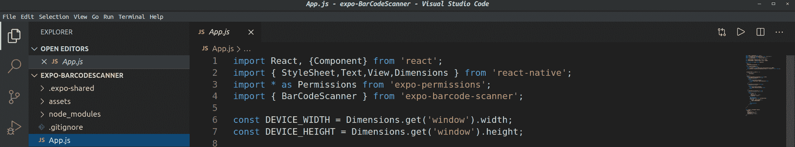
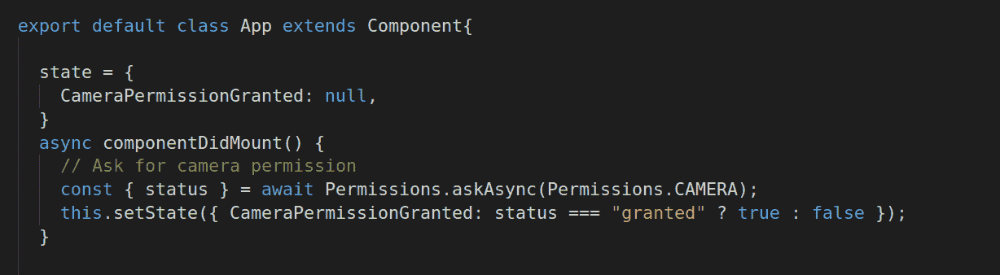
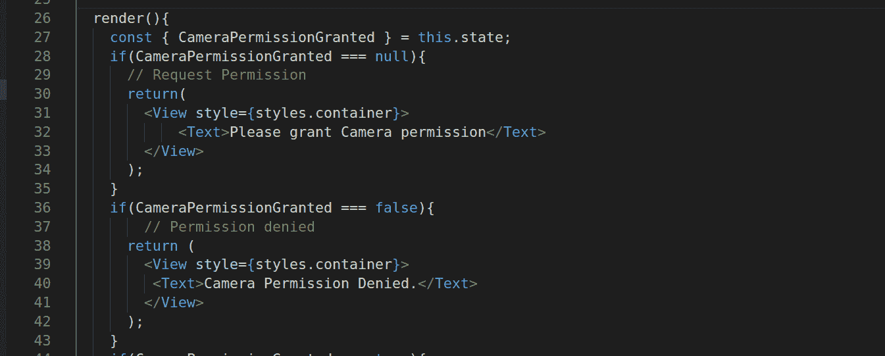
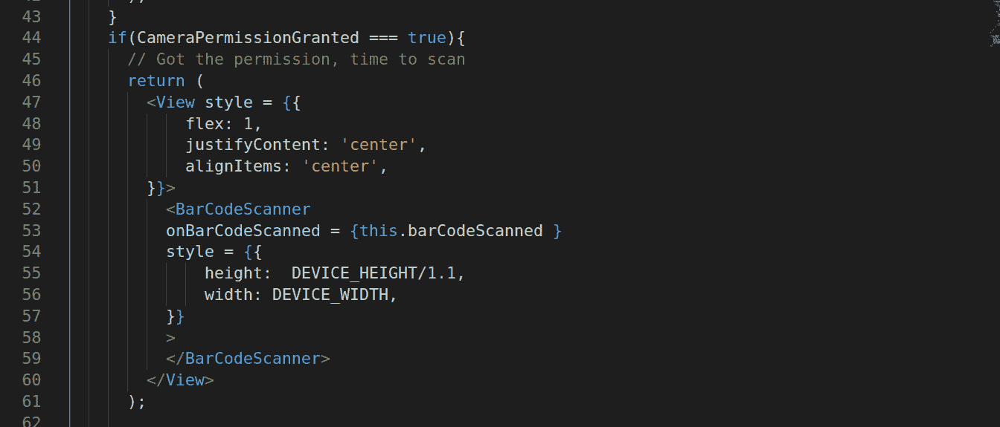
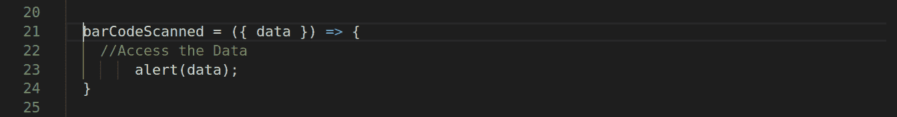

# 原生反应| Expo–条形码扫描仪

> 原文:[https://www . geesforgeks . org/react-native-Expo-barcodescanner/](https://www.geeksforgeeks.org/react-native-expo-barcodescanner/)

本文的目的是通过开发一个简单的扫描仪应用程序，了解 Expo 对**条形码扫描仪**组件的使用。
在进入开发部分之前，我们需要初始化项目并安装依赖项。因此，打开终端并输入以下命令:

```
expo init // Choose the Blank template when prompted
```

移动到项目文件夹中，然后运行以下命令:

```
expo install expo-barcode-scanner
```

现在我们已经安装了扫描仪组件，是时候编写代码了。让我们从导入所需的组件开始，其代码如下所示:



现在是时候进入应用程序类，一步一步地执行开发过程了

### 请求访问摄像机的许可:

在这一步中，我们将提示用户获取访问摄像机的权限。该请求的状态存储在组件的状态中，其代码如下所示:



现在，在渲染函数中，我们将根据请求的状态返回不同的视图，如下所示:



在用户授予我们访问摄像机的权限后，我们将返回条形码扫描仪组件，这将在下一部分中演示。

### 扫描代码。

得到许可后，是时候进入条形码扫描仪组件了。



是时候定义条形码扫描函数来访问响应数据了，这将在下一步中演示。

### 访问响应数据。

我们将以响应数据为例提醒用户。



我们已经成功地完成了这个简单的条形码扫描仪应用程序的开发过程。

**github repo link:t1】https://github . com/notnotaparas/Expo-barcoder**

**空气污染指数参考值:**https://docs.expo.io/versions/latest/sdk/bar-code-scanner/