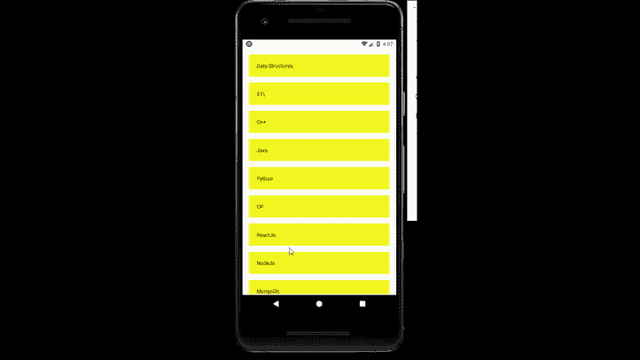

# 反应原生平面列表组件

> 原文:[https://www . geesforgeks . org/react-native-flat list-component/](https://www.geeksforgeeks.org/react-native-flatlist-component/)

在本文中，我们将看到如何在 react-native 中创建一个平面列表。为此，我们将使用 FlatList 组件。它用于在可滚动列表视图中呈现项目。

**语法:**

```
<FlatList
   data={}
   renderItem={}
/> 
```

**平面列表中的道具:**

*   **renderItem:** 用于将数据渲染到列表中。
*   **数据:**它基本上是一个数据数组。
*   **ItemSeparatorComponent:** 用于在每个项目之间进行渲染。
*   **ListEmptyComponent:** 列表为空时呈现。
*   **ListFooterComponent:** 它呈现在所有项目的底部。
*   **listbootercomponent style:**用于为*listbootercomponent*设置内部视图样式。
*   **列表头组件:**它呈现在所有项目的顶部。
*   **列表头组件样式:**用于设置内部视图的样式*列表头组件*。
*   **columnWrapperStyle:** 这是多项目行的可选自定义样式。
*   **extraData:** 是告诉列表重新渲染的属性。
*   **getItemLayout:** 这是一个可选的优化，如果你知道项目的大小，可以跳过动态内容的测量。
*   **水平:**如果这是真的，那么项目将被水平渲染而不是垂直渲染。
*   **initialNumToRender:** 它告诉在初始批次中要渲染多少个项目。
*   **initialScrollIndex:** 如果提供，那么它将从 *initialScrollIndex 项目开始，而不是从最上面的项目开始。*
*   **反转:**反转卷轴方向。
*   **密钥提取器:**用于提取给定项目的唯一密钥。
*   **numColumns:** 用于渲染多列。
*   **OneDreaked:**当滚动位置进入渲染内容时调用一次。
*   **one dreachedthreshold:**它告诉我们离终点还有多远。
*   **刷新:**如果提供，将添加标准刷新控制。
*   **onViewableItemsChanged:** 当行的可见性发生变化时调用。
*   **progressviewpoffset:**设置需要加载时的偏移量。它只在安卓系统上可用。
*   **刷新:**设置为真，同时等待刷新的新数据。
*   **removeclipped subview:**这可能会提高大型列表的滚动性能。在安卓系统上，默认值为真。
*   **viewpabilityconfigcallback airs:**显示配对列表。

**列表中的方法:**

*   **闪烁滚动指示器():**它会瞬间显示滚动指示器。
*   **getNativeScrollRef():** 它提供了对底层滚动组件的引用。
*   **getScrollResponder():** 它提供了底层滚动响应程序的句柄。
*   **getScrollableNode():** 它提供了底层滚动节点的句柄。
*   **recordInteraction():** 它告诉列表已经发生的交互。
*   **scrollToEnd():** 滚动到内容末尾。
*   **滚动到索引():**滚动到提供索引的特定项目。
*   **scroltoitem():**滚动到提供的项目。它需要对数据进行线性扫描。
*   **scroltooffset():**滚动到列表中特定的内容像素偏移量。

**现在我们从实现开始:**

*   **步骤 1:** 打开终端，通过以下命令安装 expo-cli。

    ```
    npm install -g expo-cli
    ```

*   **步骤 2:** 现在通过以下命令创建一个项目。

    ```
    expo init myapp
    ```

*   **第三步:**现在进入你的项目文件夹，即 myapp

    ```
    cd myapp
    ```

**项目结构:**


**示例:**现在让我们实现 FlatList。在这里，我们创建了一个课程平面列表。

## App.js

```
import React  from 'react';
import{ StyleSheet,
        Text,
        View,
        FlatList,
      } from 'react-native';
const DATA = [
  {
    id:"1",
    title:"Data Structures"
  },
  {
    id:"2",
    title:"STL"
  },
  {
    id:"3",
    title:"C++"
  },
  {
    id:"4",
    title:"Java"
  },
  {
    id:"5",
    title:"Python"
  },
  {
    id:"6",
    title:"CP"
  },
  {
    id:"7",
    title:"ReactJs"
  },
  {
    id:"8",
    title:"NodeJs"
  },
  {
    id:"9",
    title:"MongoDb"
  },
  {
    id:"10",
    title:"ExpressJs"
  },
  {
    id:"11",
    title:"PHP"
  },
  {
    id:"12",
    title:"MySql"
  },
];

const Item = ({title}) => {
  return( 
    <View style={styles.item}>
      <Text>{title}</Text>
    </View>
  );
}

export default function App() {

const renderItem = ({item})=>( 
  <Item title={item.title}/>
);
return (
  <View style={styles.container}>
    <FlatList
       data={DATA}
       renderItem={renderItem}
       keyExtractor={item => item.id}
    />
  </View>
  );
}

const styles = StyleSheet.create({
  container: {
    marginTop:30,
    padding:2,
  },
  item: {
    backgroundColor: '#f5f520',
    padding: 20,
    marginVertical: 8,
    marginHorizontal: 16,
  },
});
```

使用以下命令启动服务器。

```
npm run android
```

**输出:**如果你的模拟器没有自动打开，那么你需要手动打开。首先，去你的安卓工作室运行模拟器。现在再次启动服务器。



**参考:**T2】https://reactnative.dev/docs/flatlist