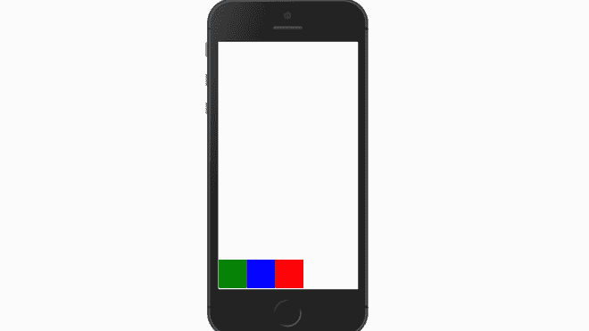

# 反应原生弹性盒对齐属性

> 原文:[https://www . geeksforgeeks . org/react-native-flexbox-alignitems-property/](https://www.geeksforgeeks.org/react-native-flexbox-alignitems-property/)

在本文中，我们将在 React Native 中看到 Flexbox alignItems 属性。Flexbox 有三个主要属性。其中之一是 alignItems。alignItems 属性用于确定子组件应如何沿其容器的次轴对齐。副轴总是与主轴相反。如果主轴是一列，那么副轴就是一行，反之亦然。

**语法:**

```
alignItems: stretch|center|flex-start|flex-end|baseline;
```

**属性值:**

*   **拉伸**:是 alignItems 的默认值。在这种情况下，儿童组件被拉伸以适应容器的副轴的高度。
*   **中心:**子组件的对齐应在容器副轴的中心。
*   **伸缩-开始:**子组件将与容器副轴的开始对齐。
*   **弯曲端:**子组件将与容器副轴的末端对齐。
*   **基线:**儿童组件将与容器的基线对齐。

**实施:**

*   **步骤 1:** 打开终端，通过以下命令安装 expo-cli。

    ```
    npm install -g expo-cli
    ```

*   **步骤 2:** 现在通过以下命令创建一个项目。

    ```
    expo init myapp
    ```

*   **第三步:**现在进入你的项目文件夹，即 myapp

    ```
    cd myapp
    ```

**项目结构:**


**示例 1:** 在此示例中，flex-direction 设置为 row，alignItems 属性值为 stretch。当我们为直线设置值**拉伸**时，我们没有给我们的次轴标注尺寸。因此，在下面的代码中，我们没有给出项目的高度。

## App.js

```
import React, { Component } from 'react';
import { View, StyleSheet } from 'react-native';

const App = (props) => {
  return (
     <View style = {styles.container}>
        <View style = {[styles.item,{backgroundColor:'green'}]} />
        <View style = {[styles.item,{backgroundColor:'blue'}]} />
        <View style = {[styles.item,{backgroundColor:'red'}]} />
     </View>
  )
}
export default App;

const styles = StyleSheet.create ({
  container: {
     flexDirection: 'row',
     alignItems: 'stretch',
     height: 700
  },
  item:{
    width:100
  }
})
```

**使用以下命令启动服务器。**

```
npm run android
```

**输出:**如果你的模拟器没有自动打开，那么你需要手动打开。首先，去你的安卓工作室运行模拟器。现在再次启动服务器。


**GFG**

**示例 2:** 在本例中，整个代码将保持不变，我们只需将 alignItems 属性的值更改为中心，并为项目提供高度。

## App.js

```
import React, { Component } from 'react';
import { View, StyleSheet } from 'react-native';

const App = (props) => {
  return (
     <View style = {styles.container}>
        <View style = {[styles.item,{backgroundColor:'green'}]} />
        <View style = {[styles.item,{backgroundColor:'blue'}]} />
        <View style = {[styles.item,{backgroundColor:'red'}]} />
     </View>
  )
}
export default App;

const styles = StyleSheet.create ({
  container: {
     flexDirection: 'row',
     alignItems: 'center',
     height: 700
  },
  item:{
    width:100,
    height:100
  }
})
```

**输出:**


**GFG**

**现在我们将保持整个代码不变，只需在 alignItems 属性值中进行更改即可看到更改。**

*   属性 flex-start 插图，请使用以下语法:

    ```
    alignItems : 'flex-start',
    ```

    

    **GFG**

*   属性**灵活结束**图示，使用以下语法:

    ```
    alignItems:'flex-end',
    ```

    

    **GFG**

*   属性**基线**图示，使用以下语法:

    ```
    alignItems:'baseline',
    ```

    

    **GFG**

**参考:**T2**https://reactnative.dev/docs/flexbox#align-items**T5】