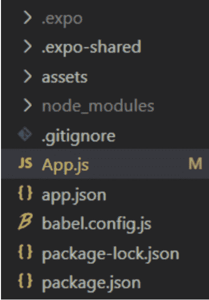
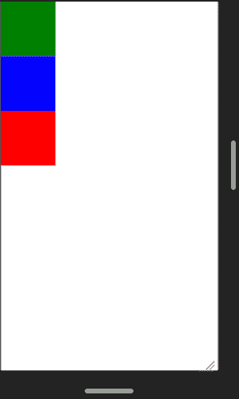
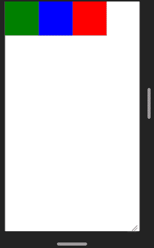
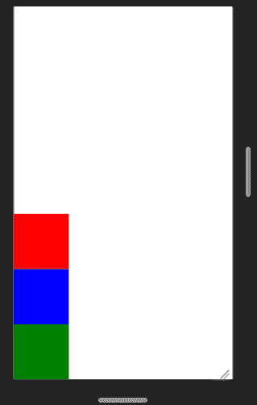
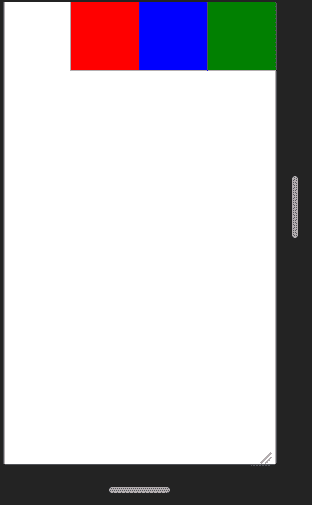

# 反应原生弹性域弹性方向属性

> 原文:[https://www . geeksforgeeks . org/react-native-flex box-flex direction-property/](https://www.geeksforgeeks.org/react-native-flexbox-flexdirection-property/)

在本文中，我们将在 React Native 中看到 Flexbox flexDirection 属性。Flexbox 有三个主要属性。其中之一就是 flexDirection。flexDirection 属性用于确定其元素在水平或垂直方向上的对齐方式。它确立了布局的主轴线。

**语法:**

```
flexDirection: 'column|row|column-reverse|row-reverse'
```

**属性值:**

*   **列:**是**flex direction 属性的默认值。它从上到下对齐子项目。**
*   ****行**:将孩子的物品从左向右对齐。**
*   ****列-反转:**它将子项目从下向上对齐。它与列值相反。**
*   ****行反转:**从右向左对齐孩子。**

****实施:****

*   ****第一步:**打开终端，通过以下命令安装 expo-cli。

    ```
    npm install -g expo-cli
    ```** 
*   ****步骤 2:** 现在使用以下命令创建一个项目。

    ```
    expo init myapp
    ```** 
*   ****第三步:**现在进入你的项目文件夹，即 myapp。

    ```
     cd myapp
    ```** 

****项目结构:**会是这样的。**

****

****示例:**在本例中，flexDirection 设置为列。**

## **App.js**

```
import React,{Component} from 'react';
import { View, StyleSheet } from 'react-native';

const App = (props) => {
  return (
     <View style = {styles.container}>
        <View style = {[styles.item,{backgroundColor:'green'}]} />
        <View style = {[styles.item,{backgroundColor:'blue'}]} />
        <View style = {[styles.item,{backgroundColor:'red'}]} />
     </View>
  )
}

export default App;

const styles = StyleSheet.create ({
  container: {
  flex:1,
     flexDirection: 'column',
  },
  item:{
    height:100,
    width:100
  }
})
```

**使用以下命令启动**服务器**。**

```
npm run android
```

****输出:**如果你的模拟器没有自动打开，那么你需要手动打开。首先，去你的安卓工作室运行模拟器。现在再次启动服务器。**

****

**现在，我们将保持整个代码不变，只需在 flexDirection 属性值中进行更改即可看到更改。**

*   **Property row illustration, use the following syntax:

    ```
    flexDirection: 'row'
    ```

    ** 
*   **Property column-reverse illustration, use the following syntax:

    ```
    flexDirection: 'column-reverse'
    ```

    ** 
*   **Property row-reverse illustration, use the following syntax:

    ```
    flexDirection: 'row-reverse'
    ```

    ** 

****参考:**T2】https://reactnative.dev/docs/flexbox#flex-direction**