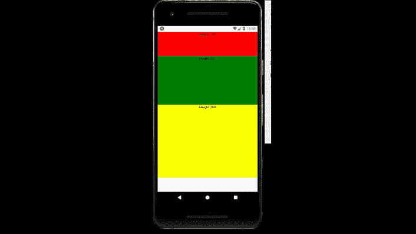

# 反应自然高度

> 原文:[https://www.geeksforgeeks.org/react-native-height/](https://www.geeksforgeeks.org/react-native-height/)

下面的方法涵盖了如何在[反应-原生](https://www.geeksforgeeks.org/introduction-react-native/)中设置高度。为此，我们将使用“高度”属性。它基本上为给定的组件提供了特定的高度。

**语法:**

```jsx
height : value
```

**现在我们从实现开始:**

*   **步骤 1:** 打开终端，通过以下命令安装 expo-cli。

    ```jsx
    npm install -g expo-cli
    ```

*   **步骤 2:** 现在通过以下命令创建一个项目。

    ```jsx
    expo init myapp
    ```

*   **第三步:**现在进入你的项目文件夹，即 myapp

    ```jsx
    cd myapp
    ```

**项目结构:**如下图。


**示例:**现在让我们实现高度。在这里，我们将为不同的文本视图提供不同的高度。

**App.js**

## App.js

```jsx
import React from 'react';
import { StyleSheet, View , Text } from 'react-native';
export default function App() {

  return (
    <View style={{marginTop : 25}}>
      <View style={{height : 100 , backgroundColor : "red"  , 
      alignItems : 'center'}}>
        <Text>Height 100</Text>
      </View>
      <View style={{height : 200 , backgroundColor : "green"  , 
      alignItems : 'center'}}>
        <Text>Height 200</Text>
      </View>
      <View style={{height : 300 , backgroundColor : "yellow"  , 
      alignItems : 'center'}}>
        <Text>Height 300</Text>
      </View>
    </View>
  );
}
```

使用以下命令启动服务器。

```jsx
npm run android
```

**输出:**如果你的模拟器没有自动打开，那么你需要手动打开。首先，去你的安卓工作室运行模拟器。现在再次启动服务器。



**参考:**T2】https://reactnative.dev/docs/height-and-width