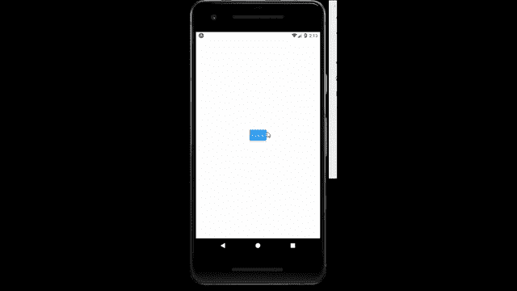

# 反应原生图像成分

> 原文:[https://www.geeksforgeeks.org/react-native-image-component/](https://www.geeksforgeeks.org/react-native-image-component/)

在本文中，我们将看到如何在 react-native 中添加图像。为此，我们将使用图像组件。它用于在 react-native 中添加图像。

**语法:**

```jsx
<Image
  source={}
/>
```

**形象中的道具:**

*   **可访问:**如果其值为真，则表示图像是可访问元素。
*   **accessibilityLabel:** 是用户与图像交互时，阅读器读取的文本。
*   **模糊半径:**是模糊滤镜的半径。
*   **角点:**如果图像被调整大小，那么角点的大小由角点指定。
*   **默认来源:**是加载图像时显示的静态图像。
*   **渐变持续时间:**是渐变动画。
*   **loadingIndicatorSource:** 表示用于渲染图像的加载指示符的资源。
*   **onError:** 出现加载错误时调用。
*   **onLayout:** 当挂载和布局发生变化时调用。
*   **onLoad:** 当镜像加载成功时调用。
*   **onLoadEnd:** 镜像加载成功或失败时调用。
*   **onLoadStart:** 当图像开始加载时调用。
*   **onpartiaload:**加载局部图像时调用。
*   **onProgress:** 下载进度时调用。
*   **progressiveRenderingEnabled:**如果为真，则启用渐进式 jpeg 流。
*   **resizeMethod:** 用于调整图像大小。
*   **来源:**是图像的来源。
*   **风格:**用于提供风格。
*   **testID:** 在 UI 自动化测试脚本中使用的这个元素的唯一标识符。

**图像中的方法:**

*   **abortPrefetch():** 它中止预取请求。
*   **getSize():** 它在显示图像之前检索图像的宽度和高度(以像素为单位)。
*   **getsizewithereaders():**它在显示图像之前检索图像的宽度和高度(以像素为单位)，并能够为请求提供标题。
*   **预取():**它是一个远程映像，通过下载到磁盘缓存供以后使用。
*   **queryCache():** 执行缓存查询。
*   **resolveAssetSource():** 它将一个资产引用解析为一个具有属性 uri、宽度和高度的对象。

**现在我们从实现开始:**

*   **步骤 1:** 打开终端，通过以下命令安装 expo-cli。

    ```jsx
    npm install -g expo-cli
    ```

*   **步骤 2:** 现在通过以下命令创建一个项目。

    ```jsx
    expo init myapp
    ```

*   **第三步:**现在进入你的项目文件夹，即 myapp

    ```jsx
    cd myapp
    ```

**项目结构:**如下图。


**示例:**现在让我们实现图像。在这里，我们创建了一个按钮，当有人点击该按钮图像将显示。

**App.js**

## App.js

```jsx
import React , {useState} from 'react';
import { StyleSheet, View ,Image , Button } from 'react-native';
export default function App() {
  const [image , setImage] = useState(false);
  return (
    <View style={styles.container}>
      <View style={!image && styles.image}>
        <Image source=
{require('E:/Projects/react-native-gfg/myapp/images/download.png')}
        />
      </View>
      <Button
        title={"click"}
        onPress={()=>{setImage(!image)}}
      />
    </View>
  );
}

const styles = StyleSheet.create({
  container: {
    flex: 1,
    alignItems: 'center',
    justifyContent: 'center',
  },
  image : {
    display : "none",
  }
});
```

使用以下命令启动服务器。

```jsx
npm run android
```

**输出:**如果你的模拟器没有自动打开，那么你需要手动打开。首先，去你的安卓工作室运行模拟器。现在再次启动服务器。



**参考:**T2】https://reactnative.dev/docs/image