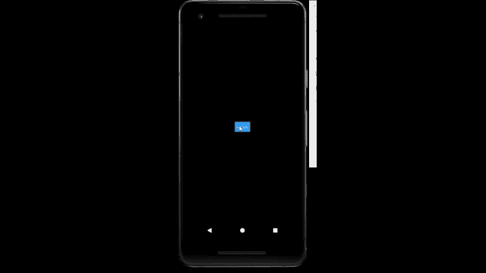

# 反应固有模态分量

> 原文:[https://www.geeksforgeeks.org/react-native-modal-component/](https://www.geeksforgeeks.org/react-native-modal-component/)

下面的方法介绍了如何在 react-native 中创建 Modal。为此，我们将使用模态组件。这是在封闭视图上呈现内容的基本方式。

**语法:**

```
<Modal
  animationType=""
  transparent={}
  visible={}
  onRequestClose={}
>
```

**莫代尔中的道具:**

*   **动画类型:**这个道具控制模式动画的方式。
*   **动画:**这个道具不推荐使用，现在使用*动画类型*代替。
*   **硬件加速:**这个道具控制是否强制底层窗口的硬件加速。它只适用于安卓设备。
*   **onDismiss:** 这个属性允许传递一个函数，一旦模态被消除，这个函数就会被调用。它只适用于 ios 设备。
*   **on orientstationchange:**当模态显示时方向改变时调用。它只适用于 ios 设备。
*   **onRequestClose:** 当用户轻按安卓上的硬件后退按钮时调用。
*   **onShow:** 这个属性允许传递一个函数，一旦显示了模态，这个函数就会被调用。
*   **presentationStyle:** 这个道具控制模态如何出现。它只适用于 ios 设备。
*   **statusBarTranslucent:** 这个道具决定了你的模态是否应该在系统 statusbar 下。
*   **支持方向定位:**这个道具允许模态旋转到任何指定的方向。它只适用于 ios 设备。
*   **透明:**这个道具决定了你的模态是否会填充整个视图。
*   **可见:**这个道具决定了你的模态是否可见。

**现在我们从实现开始:**

*   **步骤 1:** 打开终端，通过以下命令安装 expo-cli。

    ```
    npm install -g expo-cli
    ```

*   **步骤 2:** 现在通过以下命令创建一个项目。

    ```
    expo init myapp
    ```

*   **第三步:**现在进入你的项目文件夹，即 myapp

    ```
    cd myapp
    ```

**项目结构:**会是这样的。


**示例:**现在让我们实现 Modal。在这里，我们创建了一个模态，当我们点击按钮时会出现。

**App.js**

## App.js

```
import React , {useState} from 'react';
import { StyleSheet, View , Text , Modal , Button } from 'react-native';
export default function App() {
  const [active , setactive] = useState(false);
  return (
    <View style={styles.container}>
        <Modal
        animationType="slide"
        transparent={true}
        visible={active}
        onRequestClose={() => {
          console.warn("closed");
        }}
        >
          <View style={styles.container}>
            <View style={styles.View}>
            <Text style={styles.text}>GeeksforGeeks</Text>
            <Button title="close" 
                    onPress={()=>{setactive(!active)}}/>
            </View>
          </View>
        </Modal>
        <Button 
          title={"click"}
          onPress={()=>{setactive(!active)}}
        />
    </View>
  );
}

const styles = StyleSheet.create({
  container: {
    flex: 1,
    backgroundColor : "black",
    alignItems: 'center',
    justifyContent: 'center',
  },
  View : {
    backgroundColor : "white" ,
    height : 140 ,
    width : 250,
    borderRadius : 15,
    alignItems : "center",
    justifyContent : "center",
    borderColor : "black",
    borderWidth:2,
  },
  text : {
    fontSize : 20,
    color : "green",
    marginBottom:20
  },
  button : {
    margin : 20,
    width:200,
  }
});
```

使用以下命令启动服务器。

```
npm run android
```

**输出:**如果你的模拟器没有自动打开，那么你需要手动打开。首先，去你的安卓工作室运行模拟器。现在再次启动服务器。



**参考:**T2】https://reactnative.dev/docs/modal