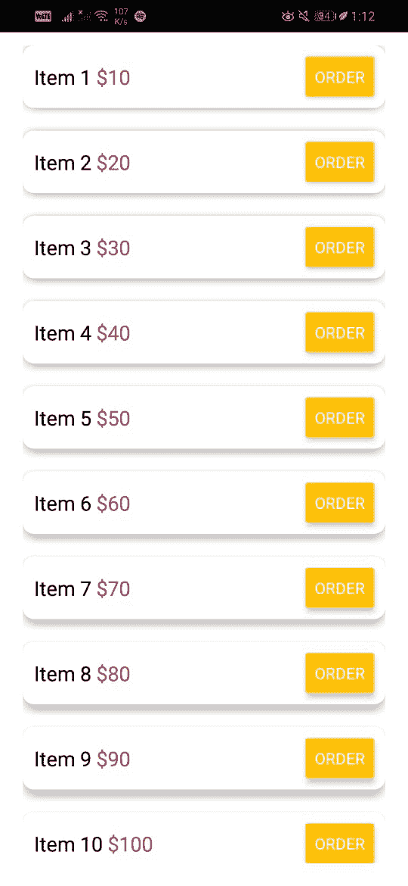

# 反应原生滚动视图组件

> 原文:[https://www . geesforgeks . org/react-native-scroll view-component/](https://www.geeksforgeeks.org/react-native-scrollview-component/)

**滚动视图**组件是一个内置的反应原生组件，作为一个通用的可滚动容器，能够滚动其中的子组件和视图。它提供垂直和水平两个方向的滚动功能(默认:垂直)。为 ScrollView 组件提供一个有限的高度是很重要的，因为它们将无界高度的子组件包含在一个有限的容器中。

**使用 ScrollView 组件的优势:**scroll view 组件最常见的用途是显示一些有限大小的项目。所有子组件(文本、视图、图像等。)，即使它们当前在屏幕上不可见。

**使用 ScrollView 组件的缺点:**使用 ScrollView 组件的主要缺点是其性能问题。由于 ScrollView 组件一次呈现其所有子组件，因此会导致呈现速度慢和内存使用增加。

**在 ScrollView 中插入**

*   **粘性标题组件:**用于渲染粘性标题的组件。如果未提供，将使用默认的 ScrollViewStickyHeader 组件。
*   **alwaysbounchehorizontal:**如果为 true，则无论内容是否小于滚动视图本身，滚动视图在到达终点时都会水平反弹。
*   **alwaysbounchevertical:**如果为真，则无论内容是否小于滚动视图本身，滚动视图在到达终点时都会垂直反弹。
*   **自动调整内容插图:**控制 iOS 是否应该自动调整位于导航栏或标签栏/工具栏后面的滚动视图的内容插图。
*   **反弹**:如果为真，则只有当内容沿滚动方向的轴大于滚动视图时，滚动视图才会在到达内容末尾时反弹。
*   **弹跳缩放**:如果为真，手势可以驱动缩放超过最小/最大值，并且缩放将在手势结束时动画化为最小/最大值。
*   **canCancelContentTouches** :如果为 false，一旦开始跟踪，触摸移动就不会尝试拖动。
*   **居中内容**:如果为真，当内容小于滚动视图边界时，滚动视图会自动将内容居中。
*   **content containers style**:这些样式将应用于包装所有子视图的滚动视图内容容器。
*   **内容插入**:指定滚动视图内容从滚动视图边缘插入的量。
*   **contentinstadjustimentbehavior**:用于指定如何使用安全区域插入来修改 ScrollView 的内容区域。
*   **内容偏移**:手动设置开始滚动偏移。
*   **减速速度**:一个浮点数，决定用户抬起手指后滚动视图减速的速度。
*   **方向锁定**:如果设置为真，滚动视图将尝试在拖动时仅锁定垂直或水平滚动。
*   **禁用时间间隔**:如果设置为真，滚动视图将在下一个索引处停止。
*   **disablecrollviewpanresponder**:如果为真，则禁用 ScrollView 上的默认 JS pan responder，对 ScrollView 内部触摸的完全控制留给其子组件。
*   **endFillColor** :有时候 scrollview 占用的空间比其内容填充的空间还多。
*   **淡入淡出长度**:淡出滚动内容的边缘。
*   **水平**:如果为真，则滚动视图的子视图水平排列成一行，而不是垂直排列成一列。
*   **指示器样式**:滚动指示器的样式。
*   **反向滚动标题**:这通常用于反向滚动视图。如果粘性标题应该粘在底部而不是滚动视图的顶部。
*   **键盘关闭模式**:用于确定键盘是否因拖动而关闭。
*   **键盘应该持续敲击**:用于确定敲击后键盘应该保持可见的时间。
*   **maintainviblecontentposition**:滚动视图将调整滚动位置，以便当前可见的第一个子视图(位于或超出 minIndexForVisible)在设置为 true 时不会改变位置。
*   **最大缩放比例**:用于表示允许的最大缩放比例。
*   **最小缩放比例**:用于表示最小允许缩放比例。
*   **嵌套滚动**:启用安卓 API 级别 21+的嵌套滚动。
*   **onContentSizeChange** :是 ScrollView 的可滚动内容视图发生变化时调用的回调函数。
*   **onmentumscrolbegin**:是动量滚动开始时调用的回调函数。
*   **onmentumscrollend**:是动量滚动结束时调用的回调函数。
*   **滚动**:滚动时每帧最多触发一次。
*   **onscrolbegindrag**:是用户开始拖动滚动视图时调用的回调函数。
*   **onScrollEndDrag** :是一个回调函数，当用户停止拖动滚动视图，或者停止或者开始滑动时调用。
*   **onscroltotop**:点击状态栏后滚动视图滚动到顶部时触发。
*   **过滚模式**:用于覆盖过滚模式的默认值。
*   **分页**:可用于水平分页。如果设置为 true，则滚动视图在滚动时会以滚动视图大小的倍数停止。
*   **持久滚动条**:使滚动条在不使用时不透明。
*   **pinchGestureEnabled** :如果为真，ScrollView 允许使用捏手势进行放大和缩小。
*   **刷新控制**:一个刷新控制组件，用于为滚动视图提供拉至刷新功能。
*   **滚动**:如果为假，则不能通过触摸交互滚动视图。
*   **scrolleceventthrottle:**控制滚动时触发滚动事件的频率。
*   **滚动指示器设置**:滚动视图指示器从滚动视图边缘插入的量。
*   **scrollpertag**:是用来记录这个滚动视图上的滚动性能的标签。
*   **scroltooverflow enabled**:如果为真，则滚动视图可以以编程方式滚动超过其内容大小。
*   **滚动至顶部**:如果为真，点击状态栏，滚动视图滚动至顶部。
*   **显示水平滚动指示器**:如果为真，显示水平滚动指示器。
*   **显示垂直滚动指示器**:如果为真，显示垂直滚动指示器。
*   **捕捉对齐**:当捕捉间隔设置为真时，捕捉对齐将定义捕捉到滚动视图的关系。
*   **快照与**配合使用:与快照集合配合使用。默认情况下，列表的末尾算作捕捉偏移。
*   **快照间隔值**:如果设置，会导致滚动视图在快照间隔值的倍数处停止。
*   **快照设置**:如果设置，使滚动视图停止在定义的偏移量处。
*   **快照启动**:与快照集合配合使用。默认情况下，列表的开头算作捕捉偏移。
*   **stickyheaderindexs**:一个子索引数组，用于确定滚动时哪些子索引停靠在屏幕顶部。
*   **zoomScale** :用于表示滚动视图内容的当前比例。

**方法:**

*   **闪烁滚动指示器():**该方法用于瞬时显示滚动指示器。
*   **scrollTo():** 该方法用于滚动到给定的 x，y 偏移，或者立即滚动，并带有平滑的动画。
*   **滚动到():**如果这是垂直滚动，视图滚动到底部。如果这是水平滚动，视图向右滚动。
*   **scroll withoutanionato():**已弃用，请改用 scrollTo。

**现在我们从实现开始:**

*   **步骤 1:** 打开终端，通过以下命令安装 expo-cli。

    ```jsx
    npm install -g expo-cli
    ```

*   **步骤 2:** 现在通过以下命令创建一个项目。

    ```jsx
    expo init myapp
    ```

*   **第三步:**现在进入你的项目文件夹，即 myapp

    ```jsx
    cd myapp
    ```

**项目结构:**如下图。


**示例:**现在让我们实现 ScrollView。在下面的示例中，我们有一个所有示例项目的可滚动列表。

## App.js

```jsx
import React, { Component } from "react";
import { Text, Button, View, StyleSheet, ScrollView } from "react-native";

class App extends Component {
  state = {
    // Sample data
    items: [
      { item: "Item 1", price: "10", id: 1 },
      { item: "Item 2", price: "20", id: 2 },
      { item: "Item 3", price: "30", id: 3 },
      { item: "Item 4", price: "40", id: 4 },
      { item: "Item 5", price: "50", id: 5 },
      { item: "Item 6", price: "60", id: 6 },
      { item: "Item 7", price: "70", id: 7 },
      { item: "Item 8", price: "80", id: 8 },
      { item: "Item 9", price: "90", id: 9 },
      { item: "Item 10", price: "100", id: 10 },
      { item: "Item 11", price: "110", id: 11 },
      { item: "Item 12", price: "120", id: 12 },
      { item: "Item 13", price: "130", id: 13 },
      { item: "Item 14", price: "140", id: 14 },
      { item: "Item 15", price: "150", id: 15 },
    ],
  };
  render() {
    return (
      <View style={styles.screen}>
        <ScrollView> // use of ScrollView Component
          {this.state.items.map((item, index) => (
            <View key={item.id}>
              <View style={styles.summary}>
                <Text style={styles.summaryText}>
                  {item.item} <Text style={styles.amount}>
                      ${item.price}</Text>
                </Text>
                <Button title="Order" color="#FFC107" 
                      onPress={() => { }} />
              </View>
            </View>
          ))}
        </ScrollView>
      </View>
    );
  }
}

// Screen styles
const styles = StyleSheet.create({
  screen: {
    margin: 20,
  },
  summary: {
    flexDirection: "row",
    alignItems: "center",
    justifyContent: "space-between",
    marginBottom: 20,
    padding: 10,
    shadowColor: "black",
    shadowOpacity: 0.26,
    shadowOffset: { width: 0, height: 2 },
    shadowRadius: 8,
    elevation: 5,
    borderRadius: 10,
    backgroundColor: "white",
  },
  summaryText: {
    fontFamily: "openSansBold",
    fontSize: 18,
  },
  amount: {
    color: "#C2185B",
  },
});

export default App;
```

使用以下命令启动**服务器**。

```jsx
npm run android
```

**输出:**如果你的模拟器没有自动打开，那么你需要手动打开。首先，去你的安卓工作室运行模拟器。现在再次启动服务器。我们将能够看到如下所示的所有项目(虚拟数据)的可滚动列表。



**参考:**T2】https://reactnative.dev/docs/scrollview