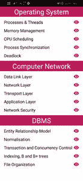

# 反应原生部分列表组件

> 原文:[https://www . geesforgeks . org/react-native-section list-component/](https://www.geeksforgeeks.org/react-native-sectionlist-component/)

截面列表组件是一个内置的反应原生列表视图组件，用于呈现截面列表。顾名思义，它用于在不同的部分显示数据列表。它是一个纯组件，支持大多数功能，如拉刷新、滚动加载、分隔符、页眉和页脚等。部分列表主要用于在部分中显示列表。在不需要部分支持的情况下，应该使用平面列表或滚动视图组件。

**语法:**

```
<SectionList
      sections={}
      renderItem={}
/>
```

**节道具列表:**

*   **renderItem:** (必选)它是一个 react 元素，用作在列表的不同部分显示项目的默认渲染器。
*   **节:**(必选)是要渲染的数据数组(不同的节有不同的对象)。
*   **extraData:** 它是一个通知列表重新渲染的属性(因为它实现了 PureComponent)。
*   **initialNumToRender:** 是初始加载屏幕时要渲染的项目数。
*   **反转:**如果设置为真，将反转滚动方向。
*   **ItemSeparatorComponent:** 它是将在每个项目之间呈现的组件(除了顶部或底部)。
*   **密钥提取器:**用于提取列表中特定项目的唯一密钥。
*   **ListEmptyComponent:** 它可以是一个组件，也可以是在列表为空的情况下呈现的 react 元素。
*   **ListFooterComponent:** 可以是一个组件，也可以是一个反应元素，呈现在列表的末尾。
*   **ListHeaderComponent:** 它可以是在列表开头呈现的组件或反应元素。
*   **onEndReached:** 是滚动位置到达 onEndReachedThreshold 时调用的回调。
*   **onEndReachedThreshold:**它是一个值，确切地告诉列表的底部应该离屏幕末端有多远，以便触发 OneDreached。
*   **刷新:**如果给定，刷新控制将被插入“拉至刷新”功能。
*   **OnView ableItemChanged:**它是在行可视性发生变化时调用的函数。
*   **刷新:**等待新数据刷新屏幕时设置为真。
*   **renderSectionFooter:** 在每个部分的底部渲染。
*   **renderSectionHeader:** 在每个部分的顶部呈现。
*   **section separator component:**渲染在每个部分的顶部和底部，以区分它们。
*   **stickySectionHeadersEnabled:**用于使节头粘在屏幕顶部。

**章节列表方法:**

*   **闪屏指示器():**用于短暂显示滚动指示器。
*   **recordInteraction():** 用于通知列表可能发生的任何交互。
*   **scrollToLocation():** 用于滚动到任意指定的 sectionIndex 和 itemIndex 处的项目。

**安装:** 在这里，我们将使用 Expo CLI 版本，这将更加流畅地运行您的 React Native 应用程序。按照以下步骤逐一设置您的 React 原生环境。

*   **步骤 1:** 打开终端，通过以下命令安装 expo-cli。

    ```
    npm install -g expo-cli
    ```

*   **步骤 2:** 现在通过以下命令创建一个项目。

    ```
    expo init sectionlist-demo
    ```

*   **第 3 步:**现在进入你的项目文件夹，即 sectionlist-demo

    ```
    cd sectionlist-demo
    ```

**项目结构:**会是这样的:


**示例:**在本例中，我们将看到如何使用基本的 SectionList 组件。

## App.js

```
import React, { Component } from "react";
import { Text, View, StyleSheet, SectionList } from "react-native";
import { Icon } from "react-native-elements";

class App extends Component {
  state = {
    data: [
      {
        title: "Operating System",
        data: [
          "Processes & Threads",
          "Memory Management",
          "CPU Scheduling",
          "Process Synchronization",
          "Deadlock",
        ],
      },
      {
        title: "Computer Network",
        data: [
          "Data Link Layer",
          "Network Layer",
          "Transport Layer",
          "Application Layer",
          "Network Security",
        ],
      },
      {
        title: "DBMS",
        data: [
          "Entity Relationship Model",
          "Normalisation",
          "Transaction and Concurrency Control",
          "Indexing, B and B+ trees",
          "File Organization",
        ],
      },
    ],
  };

  render() {
    return (
      <View style={styles.screen}>
        // Using Section List
        <SectionList
          sections={this.state.data}
          keyExtractor={(item, index) => item + index}
          renderItem={({ item }) => (
            <View style={styles.row}>
              <Text style={styles.rowText}>{item}</Text>
              <Icon name="ios-eye" type="ionicon" color="#C2185B" />
            </View>
          )}
          renderSectionHeader={({ section: { title } }) => (
            <Text style={styles.header}>{title}</Text>
          )}
        />
      </View>
    );
  }
}

// Screen styles
const styles = StyleSheet.create({
  screen: {
    marginTop: 18,
  },
  header: {
    fontSize: 30,
    color: "#FFF",
    marginTop: 10,
    padding: 2,
    backgroundColor: "#C2185B",
    textAlign: "center",
  },
  row: {
    marginHorizontal: 15,
    marginTop: 10,
    flexDirection: "row",
    justifyContent: "space-between",
    alignItems: "center",
    paddingHorizontal: 2,
  },
  rowText: {
    fontSize: 18,
  },
});

export default App;
```

**运行应用程序的步骤:**使用以下命令启动服务器。

```
npm run android
```

**输出:**如果你的模拟器没有自动打开，那么你需要手动打开。首先，去你的安卓工作室运行模拟器。现在再次启动服务器。



**参考:**T2】https://reactnative.dev/docs/sectionlist