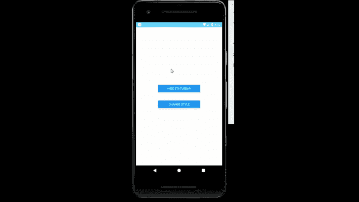

# 反应原生状态制动部件

> 原文:[https://www . geesforgeks . org/react-native-status bar-component/](https://www.geeksforgeeks.org/react-native-statusbar-component/)

下面的方法介绍了如何在 react-native 中控制 StatusBar。为此，我们将使用 StatusBar 组件。它是屏幕顶部显示通知图标的界面。

**语法:**

```
<StatusBar
  backgroundColor="#"
  barStyle={}
  showHideTransition={}
  hidden={} 
/>
```

**状态栏中的道具:**

*   **动画化:**如果状态栏属性变化之间的过渡应该动画化。
*   **backgroundColor:** 是状态栏的背景色。它只适用于安卓设备。
*   **barStyle:** 设置状态栏文本的颜色。
*   **隐藏:**隐藏状态栏。
*   **网络活动指示器可见:**网络活动指示器是否应可见。它只适用于 IOS 设备。
*   **显示隐藏过渡:**使用*隐藏*道具显示和隐藏状态栏时的过渡效果。
*   **半透明:**如果为真，那么 app 会在状态栏下绘制。

**状态栏中的方法:**

*   **popStackEntry():** 它从堆栈中获取并移除最后一个 StatusBar 条目。
*   **pushStackEntry():** 它将一个 StatusBar 条目推送到堆栈上。
*   **replaceStackEntry():** 它用新道具替换现有的 StatusBar 堆栈条目。
*   **setBackgroundColor():** 设置状态栏的背景颜色。它只适用于安卓设备。
*   **setBarStyle():** 设置状态栏样式。
*   **设置隐藏():**显示或隐藏状态栏。
*   **setnetworkactivityindicator visible():**它控制网络活动指示器的可见性。它仅适用于 IOS 设备。
*   **setTranslucent():** 控制状态栏的半透明性。

**现在我们从实现开始:**

*   **步骤 1:** 打开终端，通过以下命令安装 expo-cli。

    ```
    npm install -g expo-cli
    ```

*   **步骤 2:** 现在通过以下命令创建一个项目。

    ```
    expo init myapp
    ```

*   **第三步:**现在进入你的项目文件夹，即 myapp

    ```
    cd myapp
    ```

**项目结构:**如下图。


**示例:**现在让我们实现 StatusBar。这里我们创建了两个按钮，第一个按钮隐藏了状态栏，第二个按钮改变了状态栏的样式。

**App.js**

## App.js

```
import React , {useState} from 'react';
import { StyleSheet, View , Button , StatusBar } from 'react-native';
const STYLE = ['default', 'dark-content', 'light-content'];
export default function App() {
  let index = 0;
  const [hidden , sethidden] = useState(false);
  const [styleBar , setBar] = useState(STYLE[0]);
  const changeStyle = () => {
    index += 1;
    if(index == 3)
    {
      index = 0;
    }
    setBar(STYLE[index]);
  }
  return (
    <View style={styles.container}>
        <StatusBar
          hidden={hidden}
          animated={true}
          backgroundColor="#61dafb"
          barStyle={styleBar}
          showHideTransition={'fade'}
        />
        <View style={styles.button}>
        <Button
          title={"Hide StatusBar"}
          onPress={()=>{sethidden(!hidden)}}
        />
        </View>
        <View style={styles.button}>
        <Button
          title={"Change Style"}
          onPress={changeStyle}
        />
        </View>
    </View>
  );
}

const styles = StyleSheet.create({
  container: {
    flex: 1,
    backgroundColor: '#fff',
    alignItems: 'center',
    justifyContent: 'center',
  },
  text : {
    fontSize : 40,
    marginBottom : 30
  },
  button : {
    margin : 20,
    width:200,
  }
});
```

使用以下命令启动服务器。

```
npm run android
```

**输出:**如果你的模拟器没有自动打开，那么你需要手动打开。首先，去你的安卓工作室运行模拟器。现在再次启动服务器。



**参考:**T2】https://reactnative.dev/docs/statusbar