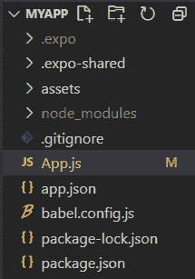

# 反应原生风格道具

> 原文:[https://www.geeksforgeeks.org/react-native-style-prop/](https://www.geeksforgeeks.org/react-native-style-prop/)

在 React Native 中，我们可以使用 JavaScript 来设计我们的应用程序。所有核心组件都接受一个名为 style 的道具。样式名称和值通常与 CSS 在 web 上的工作方式相匹配，除了名称是使用 camel 大小写。

样式道具可以是一个普通的旧 JavaScript 对象。我们还可以传递一系列样式。

**语法:**

```
<component_tag style={styles.bigBlue}>...</component_tag>
OR
<component_tag style={[styles.bigBlue, styles.red]}>...</component_tag>
```

**现在我们从实现开始:**

*   **步骤 1:** 打开终端，通过以下命令安装 expo-cli。

    ```
    npm install -g expo-cli
    ```

*   **步骤 2:** 现在通过以下命令创建一个项目。

    ```
    expo init myapp
    ```

*   **第三步:**现在进入你的项目文件夹，即 myapp

    ```
    cd myapp
    ```

**项目结构:**



**示例:**现在让我们使用样式道具为任何文本或任何组件设置样式。这里我们将背景色设置为绿色，使按钮居中。

## App.js

```
import React from 'react';
import { StyleSheet,
        Text,
        View,
        Button,
        Alert
        } from 'react-native';

export default function App() {

// Alert function
const alert = ()=>{
    Alert.alert(
    "GeeksforGeeks",
    "A Computer Science Portal",
    [
        {
        text: "Cancel",
        },
        {
        text: "Agree",
        }
    ]
    );
}

return (
    <View style={styles.container}>
      <Button title={"Register"} onPress={alert}/>
    </View>
);
}

const styles = StyleSheet.create({
container: {
    flex: 1,
    backgroundColor: 'green',
    alignItems: 'center',
    justifyContent: 'center',
},
});
```

使用以下命令启动服务器。

```
npm run android
```

**输出:**如果你的模拟器没有自动打开，那么你需要手动打开。首先，去你的安卓工作室运行模拟器。现在再次启动服务器。


**参考:**T2】https://reactnative.dev/docs/style