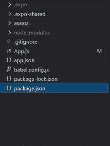

# 对本机交换机应用编程接口做出反应

> 原文:[https://www.geeksforgeeks.org/react-native-switch-api/](https://www.geeksforgeeks.org/react-native-switch-api/)

在本文中，我们将看到如何在 [react-native](https://www.geeksforgeeks.org/introduction-react-native/) 中使用 Switch。为此，我们将使用开关组件。它是一个受控组件，需要一个回调函数来更新道具以显示用户的动作。

**语法:**

```jsx
<Switch
       // props
       trackColor={}
       thumbColor={}
       value={}
/>
```

**开关中的道具:**

*   **禁用:**如果其值为真，则用户将无法切换开关。
*   **ios_backgroundColor:** 仅适用于 ios。基本上是针对 IOS 中的自定义背景色。
*   **onChange:** 当用户试图更改开关值时调用。它接收变更事件作为参数。
*   **onValueChange:** 当用户试图更改开关的值时，它也会被调用。但是它接收已更改的值作为参数，而不是事件。
*   **拇指颜色:**基本上是前景开关手柄的颜色。
*   **trackColor:** 基本是开关轨道的颜色。
*   **值:**是开关的值。默认情况下，它是假的。

**现在我们从实现开始:**

*   **步骤 1:** 打开终端，通过以下命令安装 expo-cli。

    ```jsx
    npm install -g expo-cli
    ```

*   **步骤 2:** 现在通过以下命令创建一个项目。

    ```jsx
    expo init myapp
    ```

*   **第三步:**现在进入你的项目文件夹，即 myapp

    ```jsx
    cd myapp
    ```

**项目结构:**



**示例:**现在让我们实现 Switch。在这里，我们创建了一个开关，当有人切换开关时，开关的颜色和文本将会改变。

**App.js**

## java 描述语言

```jsx
import React , {useState} from 'react';
import {StyleSheet,
        Text,
        View,
        Switch
        } from 'react-native';

export default function App() {

  const [Enable , setEnable]  = useState(false);

  // Toggle function
  const toggle = (state)=>{
    setEnable(state);
  }

  return (
    <View style={styles.container}>
      <Text style={{color : Enable ? "red" : "green"}}>
        GeeksforGeeks
      </Text>
      <Switch
        trackColor={{ false: "#43f746", true: "#63dff2" }}
        thumbColor={Enable ? "#faf68c" : "#e243f7"}
        onValueChange={toggle}
        value={Enable}
      />
    </View>
  );
}

const styles = StyleSheet.create({
  container: {
    flex: 1,
    alignItems: 'center',
    justifyContent: 'center',
  },
});
```

使用以下命令启动服务器。

```jsx
npm run android
```

**输出:**如果你的模拟器没有自动打开，那么你需要手动打开。首先，去你的安卓工作室运行模拟器。现在再次启动服务器。


**参考:**T2】https://reactnative.dev/docs/switch