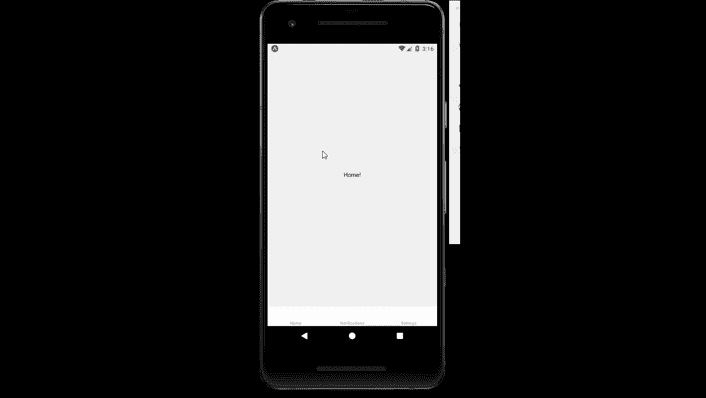

# 反应原生标签导航组件

> 原文:[https://www . geesforgeks . org/react-native-tab-navigation-component/](https://www.geeksforgeeks.org/react-native-tab-navigation-component/)

在本文中，我们将看到如何在 react-native 中实现选项卡导航。为此，我们将使用 createBottomTabNavigator 组件。它基本上用于从一个页面到另一个页面的导航。如今，移动应用程序由一个屏幕组成，所以在 React Native 中创建各种导航组件。我们想使用反应导航。

**语法:**

```
const Tab = createBottomTabNavigator();
<Tab.Navigator >
   <Tab.Screen/>
</Tab.Navigator>
```

**标签导航中的道具:**

*   **initial routiname:**是应用程序加载时打开的初始路由。
*   **顺序:**它基本上设置了选项卡的顺序。
*   **路径:**它控制路径屏幕到路径配置的映射。
*   **lazy:** 如果其值为真，则选项卡在第一次激活时呈现。其默认值为真。
*   **tabBarComponent:** 可选道具。它会覆盖用作选项卡栏的组件。
*   **标签选项:**它是一个有很多属性的对象，比如标签样式、显示标签、显示图标、样式等等…

**现在我们从实现开始:**

*   **步骤 1:** 打开终端，通过以下命令安装 expo-cli。

    ```
    npm install -g expo-cli
    ```

*   **步骤 2:** 现在通过以下命令创建一个项目。

    ```
    expo init myapp
    ```

*   **第三步:**现在进入你的项目文件夹，即 myapp

    ```
    cd myapp
    ```

*   **第 4 步:**现在在你的项目中安装反应导航。反应导航用于从一个页面导航到另一个页面。使用以下命令安装它。

    ```
    npm install @react-navigation/native
    ```

*   **步骤 5:** 现在使用以下命令将依赖项安装到您的 react-native 项目中。

    > npm 安装反应-本地-重新激活反应-本地-手势-处理程序反应-本地-屏幕反应-本地-安全区域-上下文@反应-本地-社区/屏蔽-视图

*   **第 6 步:**现在从反应导航安装底部标签。

    ```
    npm install @react-navigation/bottom-tabs
    ```

**对于反应标签导航:**这也可以用于反应原生

```
https://reactnavigation.org/docs/tab-based-navigation/
```

**项目结构:**


**示例:**现在让我们实现选项卡导航。

## App.js

```
import * as React from 'react';
import { Text, View } from 'react-native';
import { NavigationContainer } 
         from '@react-navigation/native';
import { createBottomTabNavigator } 
         from '@react-navigation/bottom-tabs';

function Home() {
  return (
    <View style={{ flex: 1, justifyContent: 'center', 
                   alignItems: 'center' }}>
      <Text>Home!</Text>
    </View>
  );
}

function Setting() {
  return (
    <View style={{ flex: 1, justifyContent: 'center', 
                   alignItems: 'center' }}>
      <Text>Settings!</Text>
    </View>
  );
}

function Notification() {
  return (
    <View style={{ flex: 1, justifyContent: 'center',
                   alignItems: 'center'}}>
      <Text>Notifications!</Text>
    </View>
  );
}

const Tab = createBottomTabNavigator();

export default function App() {
  return (
    <NavigationContainer >
      <Tab.Navigator initialRouteName={Home} >
        <Tab.Screen name="Home" component={Home}  />
        <Tab.Screen name="Notifications" 
                    component={Notification} />
        <Tab.Screen name="Settings" component={Setting} />
      </Tab.Navigator>
    </NavigationContainer>
  );
}
```

使用以下命令启动服务器。

```
npm run android
```

**输出:**如果你的模拟器没有自动打开，那么你需要手动打开。首先，去你的安卓工作室运行模拟器。现在再次启动服务器。



**参考:**T2】https://reactnative.dev/docs/navigation#react-navigation