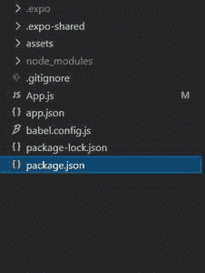
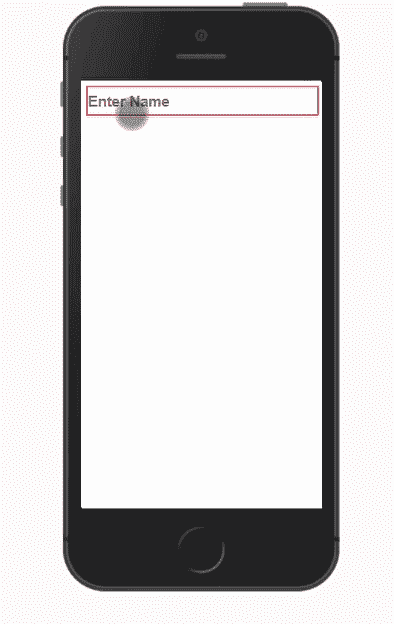

# 反应原生文本输入组件

> 原文:[https://www . geesforgeks . org/react-native-text-input-component/](https://www.geeksforgeeks.org/react-native-text-input-component/)

在本文中，我们将看到如何在 react-native 中创建一个文本输入。为此，我们将使用文本输入组件。它是用于从用户收集数据的基本组件。

为了在反应原生中创建文本输入，我们必须从反应原生中导入文本输入组件。

```
import { TextInput } from 'react-native'
```

**语法:**

```
<TextInput  
  // Define TextInput property
/>        
```

**文本输入组件道具:**

*   **允许字体缩放:**该属性将指定字体是否会根据文本大小辅助功能设置进行缩放。默认值为真。
*   **自动大写:**该属性用于自动大写字母。我们可以通过**无、句子、单词、字符**作为参数。默认情况下，它将每个句子的首字母大写。
*   **自动完成类型:**该属性通过给出建议为输入提供自动填充。自动完成类型支持的一些值有:关闭、密码、用户名、邮政编码、“电子邮件”、街道地址、抄送号码、抄送月份、姓名等。默认情况下，自动完成类型在所有安卓设备中都是真的。要禁用自动完成，我们需要将其设为 false。
*   **自动更正:**此属性采用布尔值。它会自动更正输入字段，但如果它为假，则不会更正它。默认值为真。
*   **自动对焦:**如果为真，则将输入聚焦在 componentDidMount 上。在默认情况下，它将是假的，
*   **模糊提交:**用于提交时模糊输入字段。对于单行字段，默认值为真，但对于多行字段，默认值为假。
*   **caretHidden:** 默认情况下为假。但是如果是真的，插入符号将被隐藏。
*   **清除按钮模式:**当我们希望清除按钮出现在文本视图的右侧时，会用到。这仅适用于单行文本输入组件。默认值是从不。
*   **clearTextOnFocus:** 当我们想要在编辑开始时自动清除文本字段时，使用该属性。
*   **contextMenuHidden:** 默认情况下，为假。但如果是真的，上下文菜单会被隐藏。
*   **数据检测类型:**该属性用于确定文本输入中转换为可点击网址的数据类型。默认情况下，不会检测到任何数据类型。
*   **默认值:**当用户开始输入时，该属性将提供一个初始值。对于用户不想写入整个值的用例来说，这很有用。
*   **disableFullscreenUI:** 在默认情况下，为 false。此属性允许用户在全屏文本输入模式下编辑文本。要禁用此功能，我们需要将其设为真。
*   **可编辑:**如果我们不希望用户编辑文本输入，那么我们可以将该可编辑值设为 false。它不允许用户从前端编辑文本。默认情况下，该值为真。
*   **自动启用返回键:**该属性将让键盘在有文本时自动启用返回键，否则返回键将被禁用。默认值为 false。
*   **重要信息自动填充:**这将告诉视图结构中包含哪些字段用于自动填充。默认情况下，它是自动的。
*   **inlineImageLeft:** 用于渲染左边的图像。
*   **内嵌图像填充:**该属性用于在内嵌图像和文本输入之间提供填充。
*   **键盘外观:**用于指定键盘的颜色。颜色可以是默认颜色、浅色和深色。
*   **键盘类型**:该属性用于确定将要打开的键盘类型。
*   **maxFontSizeMultiplier:** 当 allowFontScaling 启用时，用于指定字体可以达到的最大比例。
*   **最大长度:**当我们不想超过特定的字符数时使用。所以我们给它提供一个固定的最大长度。
*   **多行:**这允许在文本输入中有多行。默认情况下，该值为假**。**
*   **行数:**当我们想要文本输入中的固定行数时使用。
*   **onbulr:**当通过调用我们写东西的回调函数来模糊文本输入时使用。
*   **onChange:** 每当 TextInput 有任何变化，这将调用一个回调函数。
*   **onChangeText:** 每当 TextInput 的文本有变化时，这将调用一个回调函数。
*   **onContentSizeChange:** 当文本输入的内容大小发生变化时，它会调用一个回调函数。
*   **onendeding:**当文本输入结束时，它会调用一个回调函数。
*   **onpressure**:是释放按键时调用的回调函数。
*   **onFocus:** 文本输入聚焦时，调用回调函数。
*   **onKeyPress:** 它在我们执行任务的地方按下一个键时调用一个回调函数。
*   **onLayout:** 是布局改变时调用的函数。
*   **onScroll:** 是在内容滚动时调用的功能。
*   **onSelectionChange:** 当文本输入选择发生变化时。它调用回调函数来执行相关任务。
*   **按下文本输入的提交按钮时，点击编辑按钮:**。它调用回调函数来执行与其相关的任务。
*   **占位符:**它提供了在进入文本输入之前将首次呈现的字符串。
*   **placeholderTextColor:** 提供占位符的文本颜色。
*   **返回键标签:**设置标签的返回键。
*   **returnKeyType:** 决定了回车键的外观。returnKeyType 的一些值是“完成”、“开始”、“下一个”、“搜索”、“发送”、“无”、“上一个”、“默认”、“紧急呼叫”、“谷歌”、“加入”、“路由”、“雅虎”。
*   **滚动启用:**启用文本视图的滚动。默认情况下，这是真的。
*   **secureTextEntry:** 用于通过隐藏输入的文本来保护密码等敏感数据。默认值为假。
*   **选择文本焦点:**它用于选择所有文本时会自动进行，当我们聚焦文本输入时。
*   **showSoftInputOnFocus:** 如果这个是假的**，**那么当我们聚焦场的时候。它阻止软键盘显示。默认值为真。
*   **拼写检查:**启用拼写检查样式(即红色下划线)。要禁用它，我们必须将它设置为假。默认值继承自自动更正。
*   **文本对齐:**该属性用于对齐输入文本。文本对齐的值为:左、右和居中。
*   **textContentType:** 给出用户输入内容的相关信息。
*   **密码规则:**当我们对密码有一定要求时，我们把这个要求交给操作系统。
*   **样式:**是输入文本的自定义样式。这不支持所有的文本样式。
*   **下划线生态蓝线:**为文本输入的下划线赋予颜色。
*   **值:**是文本输入的值。

**现在我们从实现开始:**

*   **步骤 1:** 打开终端，通过以下命令安装 expo-cli。

    ```
    npm install -g expo-cli
    ```

*   **步骤 2:** 现在通过以下命令创建一个项目。

    ```
    expo init myapp
    ```

*   **第三步:**现在进入你的项目文件夹，即 myapp

    ```
    cd myapp
    ```

**项目结构:**



**示例:**现在让我们实现 TextInput 组件。在该组件中，只要有任何文本更改，它就调用函数 handleText，将名称状态设置为文本。该文本将被写入文本组件。

## App.js

```
import React, { Component } from 'react';
import {View,Text,TextInput } from 'react-native';

export default class App extends Component {
  state={
    name:"",
  }
  handleText=(text)=>{
    this.setState({name:text});
  }
  render() {
    return (
      <View>
      <TextInput
        style={{height: 50, borderColor: 'red', 
                borderWidth: 3,margin:10,
        fontSize:35,}}
        onChangeText={(text) =>this.handleText(text)}
        placeholder="Enter Name"
        value={this.state.text}
      />
      <Text style={{fontSize:32,color:'green'}}>
        Your name is :{this.state.name}
      </Text>
      </View>
    );
  }
}
```

使用以下命令启动服务器。

```
npm run android
```

**输出:**如果你的模拟器没有自动打开，那么你需要手动打开。首先，去你的安卓工作室运行模拟器。现在再次启动服务器。



**参考:**T2】https://reactnative.dev/docs/textinput