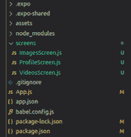
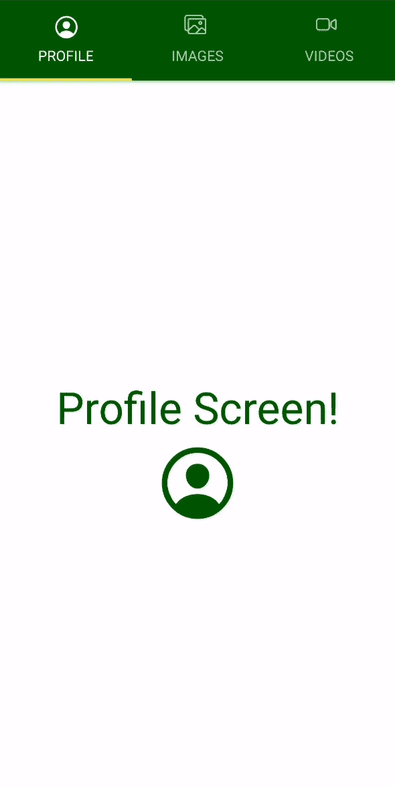

# 反应原生顶部标签导航器

> 原文:[https://www . geesforgeks . org/react-native-top-tab-navigator/](https://www.geeksforgeeks.org/react-native-top-tab-navigator/)

要创建顶部选项卡导航器，我们需要使用反应导航库中可用的 createMaterialTopTabNavigator 函数。它是用屏幕顶部的材质主题标签栏设计的。它允许通过轻按或水平滑动在各种选项卡之间切换。默认过渡动画可用。

**道具:**在 React Native 中，当组件被创建时，必须根据属性被称为道具的需要来定制它们。

*   **initial routiname:**initial routiname 是用于路由导航器初始加载时呈现的名称的道具。
*   **屏幕选项:**屏幕选项是 React Native 中的道具，用作导航器内屏幕的默认选项。默认选项用于应用所有屏幕导航器。
*   **标签栏位置:**这种类型的道具用于设置标签栏在标签视图中的位置，默认值设置在“顶部”。
*   **惰性:**惰性道具用于检查指示屏幕是否会被惰性渲染的布尔值。默认情况下，屏幕显示在视口体验中。
*   **lazyPlaceholder:**React Native 中的 lazyPlaceholder 道具是一个函数，它返回一个 React 元素，用于为那些尚未渲染的路线进行渲染。默认情况下，渲染值为空。
*   **removeclipped subview:**removeclipped subview sa 用于改进内存层次结构。它采用布尔值，该值指示是否从视图层次结构中移除不可见的视图。
*   **键盘关闭模式:**该属性用于获取字符串值，该值指示键盘是否作为对拖动手势的响应而关闭。键盘关闭模式中的其他值为自动、拖动、无。
*   **定时配置:**定时配置道具定时一个用于定时动画的配置对象，当按下标签时发生。timingConfig 的其他属性是持续时间和数量。
*   **位置:**用于收听位置更新的动画值。当用户按下标签时，它会不时地改变。

**选项:**反应原生中的选项用于配置目的。在导航器中配置屏幕时执行配置。

*   **标题:**选项标题通常用作 headerTitle 和 tabBarLabel 的后备。
*   **tabBarIcon:**tabBarIcon 选项返回 React。用于在标签栏部分显示的节点是颜色:reactions Native 小部件中的字符串。
*   **标签标签:**标签标题字符串中的标签，该标签显示在屏幕小部件的标签栏部分中。
*   **tab baraccessibilitylabel:**它是一个选项，可以是一个辅助功能标签，当用户按下选项卡时，屏幕阅读器会读取该标签。
*   **标签按钮:**标签按钮选项可以是用于在测试中定位该标签按钮的标识。

**事件:**

*   **tabPress:** 当用户按下标签栏部分中当前屏幕的标签按钮时，tabPress 事件集关闭。默认情况下，当我们将其滚动到顶部时使用。
*   **tabLongPress:** 当用户长时间按下标签栏中当前屏幕的标签按钮时触发的事件。

**帮手:**

*   跳转到:助手跳转到用于执行一个函数来导航选项卡导航器中的现有屏幕，该功能接受名称和参数作为其参数，其中名称是字符串，参数是对象。

**现在让我们看看如何创建顶部选项卡导航器:**

*   **步骤 1:** 打开终端，通过以下命令安装 expo-cli。

    ```
    npm install -g expo-cli
    ```

*   **步骤 2:** 现在通过以下命令创建一个项目。

    ```
    expo init top-tab-navigator-demo
    ```

*   **第三步:**现在进入你的项目文件夹，即顶部-标签-导航-演示

    ```
    cd top-tab-navigator-demo
    ```

*   **步骤 4:** 使用以下命令安装所需的软件包:

    > npm 安装-保存反应-导航反应-导航-选项卡反应-原生-纸张反应-原生-矢量-图标

    **项目结构:**项目目录应该如下所示:

    

    **示例:**

    现在，让我们在 App.js 文件中设置顶部选项卡导航器。在我们的演示应用程序中将有 3 个屏幕:主屏幕、用户屏幕和设置屏幕。因此，我们将有 3 个选项卡在这 3 个屏幕之间导航。

    **示例:**首先，我们将添加我们的 App.js 文件，该文件将保存物料底部标签导航器逻辑。除了关于屏幕和标签的基本信息，我们还将在设置时添加图标和基本样式。

    ## App.js

    ```
    import React from "react";
    import { Ionicons } from "@expo/vector-icons";
    import { createAppContainer } from "react-navigation";
    import { createMaterialTopTabNavigator } from "react-navigation-tabs";

    import ProfileScreen from "./screens/ProfileScreen";
    import ImagesScreen from "./screens/ImagesScreen";
    import VideoScreen from "./screens/VideosScreen";

    const TabNavigator = createMaterialTopTabNavigator(
      {
        Profile: {
          screen: ProfileScreen,
          navigationOptions: {
            tabBarLabel: "Profile",
            showLabel: ({ focused }) => {
              console.log(focused);
              return focused ? true : false;
            },
            tabBarIcon: (tabInfo) => (
              <Ionicons
                name="ios-person-circle-outline"
                size={tabInfo.focused ? 25 : 20}
                color={tabInfo.tintColor}
              />
            ),
          },
        },
        Images: {
          screen: ImagesScreen,
          navigationOptions: {
            tabBarLabel: "Images",
            tabBarIcon: (tabInfo) => (
              <Ionicons
                name="ios-images-outline"
                size={tabInfo.focused ? 24 : 20}
                color={tabInfo.tintColor}
              />
            ),
          },
        },
        Video: {
          screen: VideoScreen,
          navigationOptions: {
            tabBarLabel: "Videos",
            tabBarIcon: (tabInfo) => (
              <Ionicons
                name="ios-videocam-outline"
                size={tabInfo.focused ? 25 : 20}
                color={tabInfo.tintColor}
              />
            ),
          },
        },
      },
      {
        tabBarOptions: {
          showIcon: true,

          style: {
            backgroundColor: "#006600",
            marginTop: 28,
          },
        },
      }
    );

    const Navigator = createAppContainer(TabNavigator);

    export default function App() {
      return (
        <Navigator>
          <ProfileScreen />
        </Navigator>
      );
    }
    ```

    ## Profile.js

    ```
    import React from "react";
    import { Text, View } from "react-native";
    import { Ionicons } from "@expo/vector-icons";

    const Profile = () => {
      return (
        <View style={{ flex: 1, alignItems: "center", justifyContent: "center" }}>
          <Text style={{ color: "#006600", fontSize: 40 }}>Profile Screen!</Text>
          <Ionicons name="ios-person-circle-outline" size={80} color="#006600" />
        </View>
      );
    };

    export default Profile;
    ```

    ## Images.js

    ```
    import React from "react";
    import { Text, View } from "react-native";
    import { Ionicons } from "@expo/vector-icons";

    const Images = () => {
      return (
        <View style={{ flex: 1, 
                       alignItems: "center", 
                       justifyContent: "center" }}>
          <Text style={{ color: "#006600", fontSize: 40 }}>
            Images Screen!
          </Text>
          <Ionicons name="ios-images-outline" 
                    size={80} color="#006600" />
        </View>
      );
    };

    export default Images;
    ```

    ## Videos.js

    ```
    import React from "react";
    import { Text, View } from "react-native";
    import { Ionicons } from "@expo/vector-icons";

    const Videos = () => {
      return (
        <View style={{ flex: 1, 
                       alignItems: "center",
                       justifyContent: "center" }}>
          <Text style={{ color: "#006600", fontSize: 40 }}>
             Videos Screen!
          </Text>
          <Ionicons name="ios-videocam-outline" 
                    size={80} color="#006600" />
        </View>
      );
    };

    export default Videos;
    ```

    使用以下命令启动服务器。

    ```
    expo start
    ```

    **输出:**

    

    **参考:**[https://react navigation . org/docs/material-top-tab-navigator/](https://reactnavigation.org/docs/material-top-tab-navigator/)