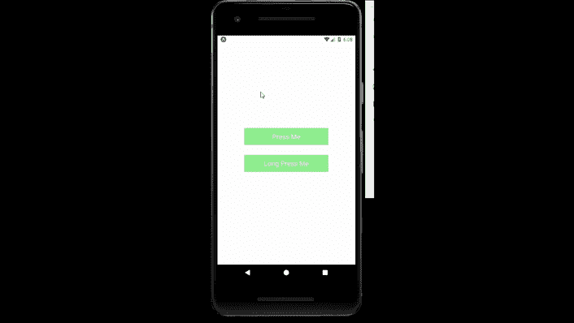

# 反应原生可触摸组件

> 原文:[https://www . geesforgeks . org/react-native-touchables-component/](https://www.geeksforgeeks.org/react-native-touchables-component/)

在本文中，我们将看到如何在 react-native 中创建一个 Touchables。为此，我们将使用可触摸组件。它用于使任何组件都可以触摸。

**语法:**

```jsx
<TouchableHighlight onPress={}>
    // Inside Components        
</TouchableHighlight>
```

**可触摸组件:**

*   **可触摸高亮显示:**你可以在任何你想在网上使用按钮或链接的地方使用它。当用户按下按钮时，视图的背景将变暗。
*   **TouchableOpacity:** 可以通过降低按钮的不透明度来提供反馈，让用户按下的同时背景也能被看穿。
*   **touchablenativebackback:**用于安卓系统中，显示响应用户触摸的墨水表面反应波纹。
*   **触摸可无反馈:**如果您需要处理轻击手势，但不想显示任何反馈，请使用*触摸可无反馈*。

**现在我们从实现开始:**

*   **步骤 1:** 打开终端，通过以下命令安装 expo-cli。

    ```jsx
    npm install -g expo-cli
    ```

*   **步骤 2:** 现在通过以下命令创建一个项目。

    ```jsx
    expo init myapp
    ```

*   **第三步:**现在进入你的项目文件夹，即 myapp

    ```jsx
    cd myapp
    ```

**项目结构:**如下图。


**示例:**现在让我们实现可触摸。在这里，我们将视图创建为可触摸的。

**App.js**

## App.js

```jsx
import React from 'react';
import { StyleSheet, View , TouchableHighlight , TouchableOpacity , Text , Alert } 
from 'react-native';
export default function App() {
  const pressAlert = (text) => {
    Alert.alert("You " + text +  " me");
  }
  return (
    <View style={styles.container}>
        <TouchableHighlight style={styles.Touch} 
            onPress={() => pressAlert("Pressed")} >
            <View style={styles.view}>
              <Text style={styles.text}>Press Me</Text>
            </View>
        </TouchableHighlight>
        <TouchableOpacity onLongPress={() => 
               pressAlert("Long Pressed")} >
            <View style={styles.view}>
              <Text style={styles.text}>Long Press Me</Text>
            </View>
        </TouchableOpacity>
    </View>
  );
}

const styles = StyleSheet.create({
  container: {
    flex: 1,
    alignItems: 'center',
    justifyContent: 'center',
  },
  view : {
    width:250,
    height:50,
    backgroundColor : "lightgreen",
    alignItems : "center",
    justifyContent : "center",
    borderColor : "black",
    borderWidth : 0.2
  },
  text : {
    fontSize : 20,
    color : "white"
  },
  Touch : {
    marginBottom : 30
  }
});
```

使用以下命令启动服务器。

```jsx
npm run android
```

**输出:**如果你的模拟器没有自动打开，那么你需要手动打开。首先，去你的安卓工作室运行模拟器。现在再次启动服务器。



**参考:**T2】https://reactnative.dev/docs/handling-touches