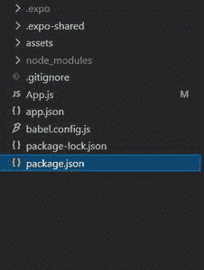

# 反应原生网络视图组件

> 原文:[https://www . geesforgeks . org/react-native-web view-component/](https://www.geeksforgeeks.org/react-native-webview-component/)

在本文中，我们将看到如何在 [react-native](https://www.geeksforgeeks.org/introduction-react-native/) 中创建一个 WebView。WebView 用于显示应用程序中的 web 内容。为此，我们将使用网络视图组件。

**语法:**

```jsx
<WebView
    source={}
/>
```

**WebView 的道具:**

*   **来源:**它基本加载网页视图中的 URL。
*   **自动调整内容插入:**控制网页视图的内容插入。它的默认值为真。
*   **注入 JavaScript:** 它将 JavaScript 注入到网页视图中。
*   **注入 JavaScript:** 它也向 web 视图注入 JavaScript，但是在视图加载时会立即运行，并且只运行一次**。**
*   **mediaplaybackrequires user action:**它确定 HTML5 音频和视频是否要求用户在开始播放前轻按它们。默认情况下，这是真的。
*   **原生图:**它覆盖了用于渲染网页视图的原生组件。
*   **onError:** 是 web 视图加载失败时调用的函数。**T3】**
*   **onLoad:** 是加载 web 视图时调用的函数。
*   **onLoadEnd:** 是 web 视图加载结束时调用的函数。
*   **onLoadStart:** 是 web 视图开始加载时调用的函数。
*   **onMessage :** 它是当 WebView 调用“ *window.postMessage* 时调用的函数。
*   **onnavigationstechange:**是 WebView 加载开始或结束时调用的函数。
*   **origin inhitelist:**这是一个允许导航到的源字符串列表。默认的原点列表是*“http://*”和“https://*”。*
*   **renderError:** 这是一个返回视图以显示是否有错误的函数。
*   **renderLoading:** 是一个返回加载指示符的函数。
*   **scalesPageToFit:** 它控制内容是否缩放以适合视图。它的默认值为真。
*   **onshouldstartloadwitrequest:**这是一个允许自定义处理任何 web 视图请求的函数。
*   **startInLoadingState:** 它基本上强制 WebView 在第一次加载时显示加载视图。
*   **减速速度:**它是一个浮点数，决定了滚动视图减速的速度。也可以使用快捷方式，即**普通**和**快捷**。
*   **domStorageEnabled:** 控制 DOM 存储是否启用。它只适用于安卓平台。
*   **javaScriptEnabled:** 控制是否启用 JavaScript。它只适用于安卓平台，默认情况下它的值是真的。
*   **mixedContentMode:基本上是 s** 指定混合内容模型。它的可能值永远是不相容的。
*   **第三方 cookiess 启用:**如果为真，则启用第三方 cookie。其默认值为真。
*   **用户代理:**设置网页视图的用户代理。
*   **allowsininemediaplayback:**决定 HTML5 视频是内嵌播放还是使用原生全屏控制器。它的默认值是假的。
*   **反弹:**决定网页视图到达内容边缘时是否反弹。其默认值为真。
*   **内容插入:**是从滚动视图的边缘插入网页视图内容的量。**T3】**
*   **数据检测类型:**它决定了在网页视图内容中转换为可点击网址的数据类型。可能的值有电话号码、链接、地址、日历事件、无和全部。
*   **滚动启用:**确定滚动是否启用。默认情况下，这是真的。
*   **地理定位已启用:**确定在网页视图中地理定位是否已启用。默认情况下，它是假的。
*   **allowuniversalacesfromfileurls:**它确定是否应该允许在文件方案 URL 的上下文中运行的 JavaScript 从任何来源访问内容。它的默认值是 false。
*   **allowFileAccess:** 判断 web 视图是否有系统文件访问。默认情况下，它是假的。
*   **useWebKit:** 这是一个不推荐使用的道具。请改用源道具。
*   **html:** 也是一个不推荐使用的道具。请改用源道具。

**WebView 中的方法:**

*   **goForward():** 它会在网页视图中带你前进一页。
*   **goBack():** 它会将你带回网页视图中的一页。
*   **reload():** 在网页视图中重新加载当前页面。
*   **停止加载():**在网页视图中停止加载。

**现在我们从实现开始:**

*   **步骤 1:** 打开终端，通过以下命令安装 expo-cli。

    ```jsx
    npm install -g expo-cli
    ```

*   **步骤 2:** 现在通过以下命令创建一个项目。

    ```jsx
    expo init myapp
    ```

*   **第三步:**现在进入你的项目文件夹，即 myapp

    ```jsx
    cd myapp
    ```

*   **第 4 步:**对于 WebView，我们在 react-native 中有一个 WebView 组件，它可以帮助我们在应用程序中显示 web 内容，但是那个组件现在已经被**弃用了**，所以作为替代，我们将使用一个名为 react-native-webview 的外部包。使用以下命令安装该软件包。

    ```jsx
    npm install react-native-webview
    ```

**项目结构:**



**示例:**现在让我们实现 WebView。在这里，我们将在网络视图中渲染[极客博客](https://www.geeksforgeeks.org/)网站。

## App.js

```jsx
import React from 'react';
import { WebView } from 'react-native-webview';
export default function App() {

  return (
    <WebView source={{ uri: 'https://geeksforgeeks.org/' }} />
  );
}
```

使用以下命令启动服务器。

```jsx
npm run android
```

**输出:**如果你的模拟器没有自动打开，那么你需要手动打开。首先，去你的安卓工作室运行模拟器。现在再次启动服务器。


**参考:**T2】https://reactnative.dev/docs/0.61/webview