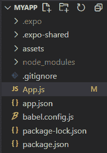

# 反应原生宽度道具

> 原文:[https://www.geeksforgeeks.org/react-native-width-prop/](https://www.geeksforgeeks.org/react-native-width-prop/)

在 React Native 中，如果我们需要设置一个组件的任何维度，就是通过给样式添加一个固定的宽度和高度，在本文中我们将使用宽度道具来设置任何组件的宽度。

**语法:**

```jsx
style={{
        width: dimension, height: dimension,
      }} />
```

尺寸宽度有三种类型，如下所述:

1.  **固定尺寸:**React Native 中的所有尺寸都是无单位的，表示密度无关的像素，这里只需使用原始数字。
2.  **伸缩尺寸:**这里使用组件样式中的伸缩来拥有可用空间，它操纵自己来捕捉空间。
3.  **百分比尺寸:**当您希望该组件填充屏幕的某个部分，但不想使用 flex 时，需要使用该选项。

**现在我们从实现开始:**

**步骤 1:** 打开终端，通过以下命令安装 expo-cli。

```jsx
npm install -g expo-cli
```

**步骤 2:** 现在通过以下命令创建一个项目。

```jsx
expo init myapp
```

**第三步:**现在进入你的项目文件夹，即 myapp

```jsx
cd myapp
```

**项目结构:**



**示例:**

## java 描述语言

```jsx
import React from 'react';
import { View } from 'react-native';

const WidthCompo= () => {

  return (
    <View style={{ height: '100%' }}>
      <View style={{
        width: '15%', height: '15%', backgroundColor: 'yellow'
      }} />
      <View style={{ flex: 3, backgroundColor: 'green' }} />
      <View style={{
        width: 150, height: 150, backgroundColor: 'purple'
      }} />
    </View>
  );
};

export default WidthCompo;
```

**输出:**


**参考:**T2**https://reactnative.dev/docs/height-and-width**T5】