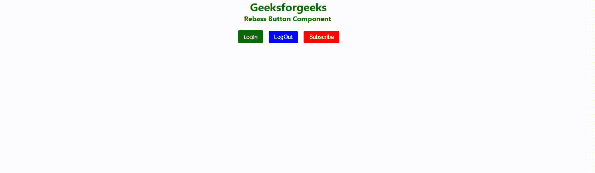

# 反作用无筋按钮组件

> 原文:[https://www . geesforgeks . org/react-rebass-button-component/](https://www.geeksforgeeks.org/react-rebass-button-component/)

**React Rebass** 是一个前端框架，设计时考虑到了 React。在本文中，我们将看到如何在 React Rebass 中使用按钮组件。按钮是每个开发都需要的重要组件。因此，为了创建一个按钮组件，我们可以导入 Rebass 按钮组件。在 Rebass Button 组件中，按钮的种类很多。

按钮组件用于制作一个按钮，指示可能的用户动作。

**语法:**

```jsx
<Button>
    Button
</Button>
```

**创建反应应用程序并安装模块:**

**步骤 1:** 使用以下命令创建一个 React 应用程序。

```jsx
npx create-react-app foldername
```

**步骤 2:** 创建项目文件夹(即文件夹名)后，使用以下命令移动到该文件夹。

```jsx
cd foldername
```

**步骤 3:** 在给定的目录中安装 React Rebass。

```jsx
 npm install --save react-toolbox
```

**项目结构**:如下图。


**示例 1:** 这是展示如何使用按钮组件的基本示例。

## App.js

```jsx
import React from "react";
import { Button } from "rebass";
import { Text } from "rebass";

const gfg = () => {
    return (
        <div id="gfg">
            <Text
                fontSize={[ 3, 4, 5 ]}
                fontWeight='bold'
                color='green'
                ml="42%">
                Geeksforgeeks
            </Text>
            <Text
                fontSize={[ 1, 2, 3 ]}
                fontWeight='bold'
                color='black'
                ml="41%">
                Rebass Button Component
            </Text>
            <br />
            <Button
                as="a"
                href="https://www.geeksforgeeks.org/"
                color="white"
                bg="green"
                mr={3}
                ml="40%"
            >
                LogIn
            </Button>
            <Button color="white" 
                    bg="blue" mr={3} 
                    variant='outline'>
                LogOut
            </Button>
            <Button color="white" 
                    bg="red" 
                    disabled="false">
                Subscribe
            </Button>
        </div>
    );
};

export default gfg;
```

**运行应用程序的步骤:**使用以下命令从项目的根目录运行应用程序。

```jsx
npm start
```

**输出:**



**参考:**T2】https://rebassjs.org/button