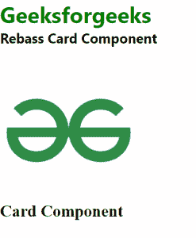

# 反应卡组件

> 原文:[https://www.geeksforgeeks.org/react-rebass-card-component/](https://www.geeksforgeeks.org/react-rebass-card-component/)

**React Rebass** 是一个前端框架，设计时考虑到了 React。在本文中，我们将了解如何在 React Rebass 中使用卡组件。卡片是具有卡片样式的盒子组件的扩展。所以要创建一个卡片组件，我们可以导入 Rebass 卡片组件。

卡片组件用于以卡片的形式显示内容，其中包含一些内容。

**语法:**

```html
<Card>
  <Image />
  <Heading></Heading>
</Card>
```

**创建反应应用程序并安装模块:**

*   **步骤 1:** 使用以下命令创建一个 React 应用程序。

```html
npx create-react-app foldername
```

*   **步骤 2:** 创建项目文件夹(即文件夹名)后，使用以下命令移动到该文件夹。

```html
cd foldername
```

*   **步骤 3:** 在给定的目录中安装 React Rebass。

```html
npm install --save react-toolbox
```

**项目结构:**如下图。


**示例 1:** 这是展示如何使用卡片组件的基本示例。

## App.js

```html
import React from "react";
import { Text } from "rebass";
import { Image, Card, Heading } from "rebass";

const gfg = () => {
    return (
        <div id="gfg">
            <Text fontSize={[3, 4, 5]} fontWeight="bold" 
            color="green">
                Geeksforgeeks
            </Text>
            <Text fontSize={[1, 2, 3]} fontWeight="bold" 
            color="black">
                Rebass Textarea Component
            </Text>
            <br />
            <Card width={2000}>
                <Image
                    src=
"https://media.geeksforgeeks.org/wp-content/cdn-uploads/gfg_200x200-min.png"
                    sx={{
                        width: ["10%"],
                    }}
                />
                <Heading>Card Component</Heading>
            </Card>
        </div>
    );
};

export default gfg;
```

**运行应用程序的步骤:**使用以下命令从项目的根目录运行应用程序。

```html
npm start
```

**输出:**



**参考:**T2】https://rebassjs.org/card