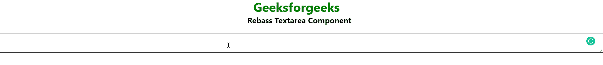

# 反应无基础形式文本区组件

> 原文:[https://www . geesforgeks . org/react-rebass-forms-textarea-component/](https://www.geeksforgeeks.org/react-rebass-forms-textarea-component/)

**React Rebass** 是一个前端框架，设计时考虑到了 React。在本文中，我们将了解如何在 React Rebass 中使用 Textarea 组件。Textarea 是每个开发中需要的一个重要组件。因此，为了创建一个文本区域组件，我们可以导入 Rebass 文本区域组件。

表单文本区域组件用于创建一个区域，用户可以在其中输入一些值。

**语法:**

```jsx
<Textarea />
```

**创建反应应用程序并安装模块:**

**步骤 1:** 使用以下命令创建一个 React 应用程序。

```jsx
npx create-react-app foldername
```

**步骤 2:** 创建项目文件夹(即文件夹名)后，使用以下命令移动到该文件夹。

```jsx
cd foldername
```

**步骤 3:** 在给定的目录中安装 React Rebass 和 form 组件。

```jsx
npm install --save react-toolbox
npm i @rebass/forms
```

**项目结构:**如下图。


**示例 1:** 这是展示如何使用表单文本区域组件的基本示例。

## App.js

```jsx
import React from "react";
import { Text } from "rebass";
import { Textarea } from "@rebass/forms";

const gfg = () => {
    return (
        <div id="gfg">
            <Text fontSize={[3, 4, 5]} fontWeight="bold"
                color="green" ml="42%">
                Geeksforgeeks
            </Text>
            <Text fontSize={[1, 2, 3]} fontWeight="bold"
                color="black" ml="41%">
                Rebass Textarea Component
            </Text>
            <br />
            <Textarea />
        </div>
    );
};

export default gfg;
```

**运行应用程序的步骤:**使用以下命令从项目的根目录运行应用程序。

```jsx
npm start
```

**输出:**



**参考:**T2】https://rebassjs.org/forms/textarea