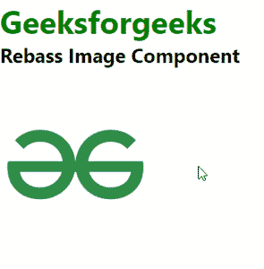

# 反应无基础图像成分

> 原文:[https://www.geeksforgeeks.org/react-rebass-image-component/](https://www.geeksforgeeks.org/react-rebass-image-component/)

**React Rebass** 是一个前端框架，设计时考虑到了 React。在本文中，我们将了解如何在 React Rebass 中使用图像组件。图像是每个开发中需要的重要组件。因此，为了创建一个图像组件，我们可以导入 Rebass 图像组件。

图像组件用于制作具有变体的响应图像组件。

**语法:**

**创建反应应用程序并安装模块:**

*   **步骤 1:** 使用以下命令创建一个 React 应用程序。

```jsx
npx create-react-app foldername
```

*   **步骤 2:** 创建项目文件夹(即文件夹名)后，使用以下命令移动到该文件夹。

```jsx
cd foldername
```

*   **步骤 3:** 在给定的目录中安装 React Rebass。

```jsx
npm install --save react-toolbox
```

**项目结构:**如下图。


**示例 1:** 这是展示如何使用图像组件的基本示例。

## App.js

```jsx
import React from "react";
import { Text } from "rebass";
import { Image } from "rebass";

const gfg = () => {
    return (
        <div id="gfg">
            <Text fontSize={[3, 4, 5]} fontWeight="bold" 
            color="green">
                Geeksforgeeks
            </Text>
            <Text fontSize={[1, 2, 3]} fontWeight="bold" 
            color="black">
                Rebass Textarea Component
            </Text>
            <br />
            <Image
                src=
"https://media.geeksforgeeks.org/wp-content/cdn-uploads/gfg_200x200-min.png"
                sx={{
                    width: ["10%"],
                }}
            />
        </div>
    );
};

export default gfg;
```

**运行应用程序的步骤:**使用以下命令从项目的根目录运行应用程序。

```jsx
npm start
```

**输出:**



**参考:**T2】https://rebassjs.org/image