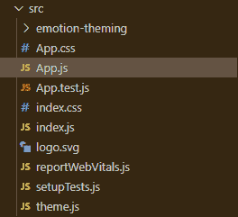

# 反应超越主题

> 原文:[https://www.geeksforgeeks.org/react-rebass-theming/](https://www.geeksforgeeks.org/react-rebass-theming/)

React Rebass 是一个前端框架，设计时考虑到了 React。在本文中，我们将了解什么是 React Rebass 中的道具。道具是每个开发都需要的重要组件。**主题化**用于为我们的项目提供颜色、印刷样式、布局样式和组件变体。通过使用主题提供者，我们可以非常容易地定制项目组件的主题。

**主题提供者:**我们将不得不在我们的项目中添加一个主题提供者组件来提供主题。

**创建反应应用程序并安装模块:**

**步骤 1:** 使用以下命令创建一个 React 应用程序。

```jsx
npx create-react-app foldername
```

**步骤 2:** 创建项目文件夹(即文件夹名)后，使用以下命令移动到该文件夹。

```jsx
cd foldername
```

**步骤 3:** 在给定的目录中安装 React Rebass 和 form 组件。

```jsx
npm i rebass
```

**第 4 步:**要添加主题提供者组件，我们必须为我们的项目安装主题 UI。要安装主题用户界面，请使用下面给出的语法:

```jsx
npm i theme-ui gatsby-plugin-theme-ui
```

**第 5 步:**现在要提供自定义主题化，我们将使用主题提供者组件。

```jsx
import { ThemeProvider } from 'theme-ui'

export default props =>
  <ThemeProvider theme={theme}>
     //Content
  </ThemeProvider>
```

**项目结构:**如下图:



**示例 1:** 为了提供它们，我们将使用名为 theme.js 的外部填充，并从该文件中导出主题对象。

## app.js

```jsx
import React from 'react'
import theme from './theme'
import { ThemeProvider } from 'theme-ui'
import {  Button , Text} from "rebass";

export default props =>
  <ThemeProvider theme={theme}>
    <div id="gfg">
      <Text
        fontSize={[3, 4, 5]}
        fontWeight='bold'
        ml="42%">
        Geeksforgeeks
      </Text>
      <Button
        sx={{
          fontSize: 3,
          margin: 20,
        }}
        color="white"
        bg="green"
        mr={3}
        ml="40%"
      >
        LogIn
      </Button>
      <Button sx={{
        fontSize: 3,
        margin: 20,
      }} color="white"
        bg="blue" mr={3}
        variant='outline'>
        LogOut
      </Button>
      <Button
        sx={{
          fontSize: 3,
          margin: 20,
        }} color="white"
        bg="red"
        disabled="false">
        Subscribe
      </Button>
    </div>
  </ThemeProvider>
```

## Theme.js

```jsx
export default {
    colors: {
        background: 'black',
        text: 'green',
    },
    buttons: {
        primary: {
            color: 'white',
            bg: 'primary',
        }
    }
}
```