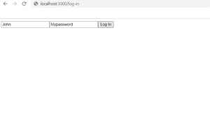

# 反应-路由器挂钩

> 原文:[https://www.geeksforgeeks.org/react-router-hooks/](https://www.geeksforgeeks.org/react-router-hooks/)

[React-Router](https://www.geeksforgeeks.org/reactjs-router/) 是一个流行的 React 库，主要用于客户端路由，并提供单页路由。它提供各种组件 API(如路由、链路、交换机等)。)可以在 React 应用程序中使用，根据单个页面中的 URL 路径名呈现不同的组件。

**先决条件:**如果您还不熟悉 React Router，请先阅读以下文章

*   [重新连接路由器](https://www.geeksforgeeks.org/reactjs-router/)
*   [路由器的反应类型](https://www.geeksforgeeks.org/reactjs-types-of-routers/)

**注意:**你需要在你的设备中安装 React > = 16.8，否则钩子不会工作。

**React Router 5 的挂钩:** React Router 5 提供 4 个挂钩，您可以在 React 应用中使用:

*   **使用历史**
*   **使用参数**
*   用途定位
*   **用户退出匹配**

我们将通过适当的例子详细讨论所有的挂钩:

**1。用法历史:**这是 React Router 提供的最流行的钩子之一。它允许您访问 React Router 使用的历史实例。使用历史实例，您可以将用户重定向到另一个页面。React Router 创建的历史实例使用一个堆栈(称为“历史堆栈”)，它存储用户访问过的所有条目。

**语法**:

```
import { useHistory } from "react-router-dom";

// Inside a functional component
export default function SomeComponent(props){
    // The useHistory() hook returns the history
    // object used by React Router
    const history = useHistory();
}
```

useHistory()返回的 history 对象有各种属性和方法。

**属性:**

*   **长度:**返回一个数字。历史堆栈中的条目数
*   **动作:**返回表示当前动作(推送、替换或弹出)的字符串。
*   **位置:**返回表示当前位置的对象。它可能具有以下属性:
    *   **路径名:**包含网址路径的字符串
    *   **搜索:**包含网址查询字符串的字符串
    *   **哈希:**包含网址哈希片段的字符串
    *   **状态:**包含位置特定状态的对象，当该位置被推送到堆栈上时，该对象被提供给推(路径，状态)。仅在浏览器和内存历史中可用。

**方法:**

*   **推送(路径、[状态]):** 将新条目推送到历史堆栈上。用于将用户重定向到页面
*   **替换(路径、[状态]):** 替换历史堆栈上的当前条目
*   **go(n):** 将历史堆栈中的指针移动 n 个条目
*   **goBack():** 相当于 go(-1)。
*   **goForward():** 相当于 go(1)。
*   **区块(提示):**区块导航。它将回调作为参数，并在导航被阻止后调用它。当您想首先确认用户是否真的想离开页面时，这非常有用。

**示例:**假设我们有一个使用“create-react-app”创建的 React 项目，该项目具有以下项目结构。

**项目结构:**

```
react-router-hooks-tutorial/
  |--public/
  |--src/
  |   |--components/
  |   |     |-->Home.js
  |   |     |-->ContactUs.js
  |   |     |-->AboutUs.js
  |   |     |-->LogIn.js
  |   |     |-->Profile.js
  |   |-->App.js
  |   |-->App.css
  |   |-->index.js
  |   |-->index.css
  |   |-->... (other files)
  |-- ...(other files)
```

假设在“LogIn.js”内部，我们有一个呈现登录页面的“LogIn”组件。LogIn 组件呈现两个输入字段，一个用于用户名，另一个用于密码。当用户单击登录按钮时，我们希望对用户进行身份验证，并将用户重定向到他/她的个人资料页面。

## log in . js-登入

```
import { useHistory } from "react-router-dom";
import { useState } from "react";

// A function that authenticates the users
function authenticateUser(userName, password) {
  // Some code to authenticate the user
}

// Hooks must be used inside a functional component
export default function Login(props) {
  //Creating a state variable
  const [userName, setUserName] = useState("");
  const [password, setPassword] = useState("");

  // Accessing the history instance created by React
  const history = useHistory();

  // Handle the user clicks the login button
  const handleClick = () => {

    // Authenticate the user
    authenticateUser(userName, password);

    // When the authentication is done
    // Redirect the user to the `/profile/${userName}` page
    // the below code adds the `/profile/${userName}` page
    // to the history stack.
    history.push(`/profile/${userName}`);
  };

  return (
    <div>
      <input
        type="text"
        value={userName}
        onChange={(e) => {
          setUserName(e.target.value);
        }}
        required
      />
      <input
        type="text"
        value={password}
        onChange={(e) => {
          setPassword(e.target.value);
        }}
        required
      />
      <button type="submit" onClick={handleClick}>
        {" "}
        Log In{" "}
      </button>
    </div>
  );
}
```

**输出:**



**登录页面**

仔细检查登录组件，函数“ **handleClick** ”获取用户名和密码，并调用“**身份验证者**函数，该函数以某种方式验证用户。身份验证完成后，我们希望将用户重定向到“配置文件/John”(假设用户名为“John”)页面。这就是 handleClick 函数的最后一行。" useHistory()" hook 返回 React Router 创建的历史实例，history.push("/profile/John ")将给定的 URL 添加到历史堆栈中，从而将用户重定向到给定的 URL 路径。同样，您可以根据需要使用历史对象的其他方法和参数。

检查下一个钩子，看看重定向到动态网址是如何工作的。

**2。useParams:** 这个钩子返回一个包含 URL 中所有参数的对象。

**语法:**

```
import { useParams } from "react-router-dom";

// Inside a functional component
export default function SomeComponent(props){
    const params = useParams();
}
```

这些网址参数在路由网址中定义。例如，

```
<Route path="/profile/:userName" component={Profile} />
```

"/profile/"后面的冒号(":")指定" userName "实际上是一个动态变量或参数。例如，在 URL/profile/johndoe 中，“johndoe”是参数“userName”的值。因此，在本例中，useParams()返回的对象是:

```
{
   userName: "johndoe"
}
```

**示例:**登录后，我们希望用户被重定向到“配置文件/用户名”URL。用户名取决于用户的给定名称。因此，我们需要根据用户给定的用户名动态设置网址路径。这很容易做到，我们需要稍微更新一下 App.js 文件。

## App.js

```
import { Route, Switch } from "react-router-dom";
import Home from "./components/Home";
import ContactUs from "./components/ContactUs";
import LogIn from "./components/LogIn";
import AboutUs from "./components/AboutUs";
import Profile from "./components/Profile";

export default function App() {
  return (
    <div className="App">
      <Switch>
        <Route path="/" exact>
          <Home someProps={{ id: 54545454 }} />
        </Route>
        <Route path="/about">
          <AboutUs />
        </Route>
        <Route path="/contact-us">
          <ContactUs />
        </Route>
        <Route path="/log-in">
          <LogIn />
        </Route>
        {/* userName is now a variable */}
        <Route path="/profile/:userName">
          <Profile />
        </Route>
      </Switch>
    </div>
  );
}
```