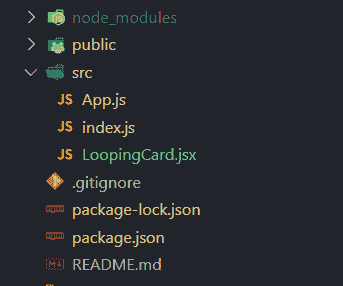

# 反作用弹簧引入和安装

> 原文:[https://www . geesforgeks . org/react-spring-introduction-and-installation/](https://www.geeksforgeeks.org/react-spring-introduction-and-installation/)

React spring 是一个动画库，它使用户界面元素的动画变得简单。它基于弹簧物理学，有助于实现自然的外观和感觉。它不同于其他动画库，在那里有人必须处理曲线、缓和、持续时间，所有这些都是相互同步的。

**平台:** React spring 是一个跨平台的库，它支持 React、react-native、web 以及更多平台。它也支持所有的浏览器。

**安装:**要在项目中安装这个库，可以从应用程序的根目录使用以下命令:

```jsx
npm install react-spring
```

**示例应用:**为了看看使用这个库执行动画有多简单，让我们创建一个小项目。我们将使用 react spring 库创建这个简单的动画。


*   **步骤 1:** 使用以下命令创建新应用程序。

    ```jsx
    npx create-react-app reactspringdemo
    ```

*   **步骤 2:** 现在使用以下命令移动创建的项目文件夹。

    ```jsx
    cd reactspringdemo
    ```

*   **步骤 3:** 安装反作用弹簧库。

    ```jsx
    npm install react-spring
    ```

我们将创建一个绕 z 轴旋转的组件**循环卡**。 **App.jsx** 是使用 LoopingCard 组件的主要组件。

**项目结构:**如下图。



项目结构。

**例:**反应弹簧的使用方式很简单。我使用了**使用 Spring** 钩子，它获取一个反映动画应该如何展开的对象。为了应用这些道具，我们必须使用在**动画**模块中定义的元素的扩展版本。只需将样式属性设置为**返回的道具，使用弹簧**将激活元素。

## LoopingCard.jsx 档案

```jsx
import React from 'react';
import { useSpring, animated } from 'react-spring'

const LoopingCard = ()=> {

    /**
     * Define the style for the animation
     * using the useSpring hook
     */
    const styles = useSpring({
        loop: true,
        from: {rotateZ: 0},
        to: {rotateZ: 360},
        duration: 2000,
    });

    /**
     * Animated div is the extended version of div that 
     * accepts the properties defined above.
     */
    return (<animated.div
            style={{
                width: 80,
                height: 80,
                backgroundColor: 'd6d6d6',
                borderRadius: 16,
                boxShadow: 'rgb(0,0,0,0.44) 0px 5px 5px',
                display: 'flex',
                alignItems: 'center',
                justifyContent: 'center',
                color: 'green',
                margin: 250,
                ...styles,
            }} >GFG</animated.div>
    );
}

export default LoopingCard;
```

使用 App.jsx 文件中的 LoopingCard 组件，并使用以下命令运行应用程序。

## App.js

```jsx
import React from 'react'
import LoopingCard from './LoopingCard'

function App() {
  console.log('hello')
  return (
    <>
      <LoopingCard />
    </>
  );
}

export default App;
```

**要运行应用程序:**运行以下命令。

```jsx
npm start
```

**输出:**

