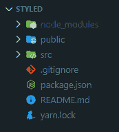
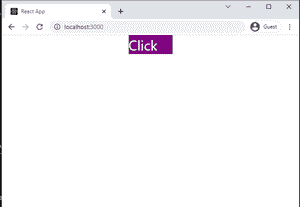
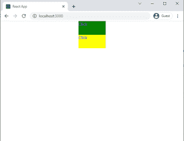

# 反应式组件模块

> 原文:[https://www . geesforgeks . org/react-style-components-module/](https://www.geeksforgeeks.org/react-styled-components-module/)

样式组件模块允许我们在反应中以非常模块化和可重用的方式在 JavaScript 中编写 CSS。我们可以使用样式化组件来增强开发人员的体验，而不是为一个 React 项目提供一个全局 CSS 文件。它还删除了组件和样式之间的映射，将组件用作低级样式构造

样式组件的主要特征:

*   自动供应商前缀
*   到处更换文风道具。
*   支持媒体查询(不同于风格道具)。
*   易于维护

**创建反应应用程序并安装模块:**

**步骤 1:** 使用以下命令创建一个反应应用程序:

```
npx create-react-app styled
```

注意:如果您之前已经通过 npm 全局安装了 create-react-app，请直接使用下面的命令。您的开发环境已经准备好了。现在让我们在应用程序中安装样式化的组件。

**步骤 2:** 创建项目文件夹(即样式)后，移动到相同的文件夹:

```
cd styled
```

**步骤 3:** 安装风格化组件:风格化组件可以在您的 React 应用程序中通过 npm 安装。按照下面给出的步骤在您的 React 应用程序中安装样式化组件。要安装样式化组件，请使用以下命令:

**带 npm:**

```
npm install --save styled-components
```

**带纱:**

```
yarn add styled-components
```

**项目结构:**如下图。



项目结构

**步骤 4:** 要在应用程序中添加样式化组件，请在您使用的编辑器中打开项目目录。

然后转到 app.js 文件。现在，在 app.js 中添加下面给出的代码。

```
import styled from "styled-components"
```

**示例:**现在在 **App.js 文件**中写下以下代码。在这里，App 是我们编写代码的默认组件。要使用样式化组件，让我们首先在 react 应用程序中创建一个组件。在项目目录中，在 src 文件夹内创建一个名为 Button.js 的文件。

## App.js

```
import Button from './Button'

function App() {
  return (
    <div >
      <Button> Click </Button>
    </div>
  );
}

export default App;
```

在模板字符串中添加基本的 css 属性。另外，在按钮组件中，我们添加了一个 div 元素。(我们可以添加**style . div**或**style . span**或**自己的 React Component**

## Button.js

```
import styled from 'styled-components'

const Button = styled.div`
    width : 100px ;
      cursor: pointer ;
    text-docration : none;
    color : white ;
    background-color : purple;
    margin : 0 auto ;
    font-size:2rem; 
`

export default Button;
```

为了创建不同样式值的多个按钮(例如:不同的颜色)，我们可以再次使用这个不同样式的按钮组件，或者我们可以只传递道具。



**第五步:**

**传球道具**

为了使样式化的组件更加动态，我们可以像在反应组件中传递道具一样传递道具。

在 App.js 中，我们传递了一个名为 bg 的带有颜色值的道具。

## App.js

```
import Button from './Button'

function App() {
  return (
    <div >
      <Button bg="green"> Click </Button>
      <Button bg="yellow"> Click </Button>
    </div>
  );
}

export default App;
```

在 Button.js 中，背景色的值我们传递一个模板字符串，其中使用三元运算符我们可以检查 props.bg 属性的值，并相应地设置背景色的值。此外，如果任何 CSS 属性需要前缀，那么 style-component 会自动这样做。

```
background-color : ${props => 
    props.bg === "green" ? "green" : "yellow"};
```

**按钮 js**

## java 描述语言

```
import styled from 'styled-components'

const Button = styled.div`
    height:50px
    width : 100px ;
    cursor: pointer ;
    text-docration : none;
    color : blue;
    background-color : ${props => props.bg === 
                      "green" ? "green" : "yellow"};
    margin: 0 auto;
    font - size: 3rem;
`

export default Button;
```

**运行应用程序的步骤:**从项目的根目录使用以下命令运行应用程序:

```
npm start
```

**输出:**现在打开浏览器，转到 **http://localhost:3000/** ，会看到如下输出:

