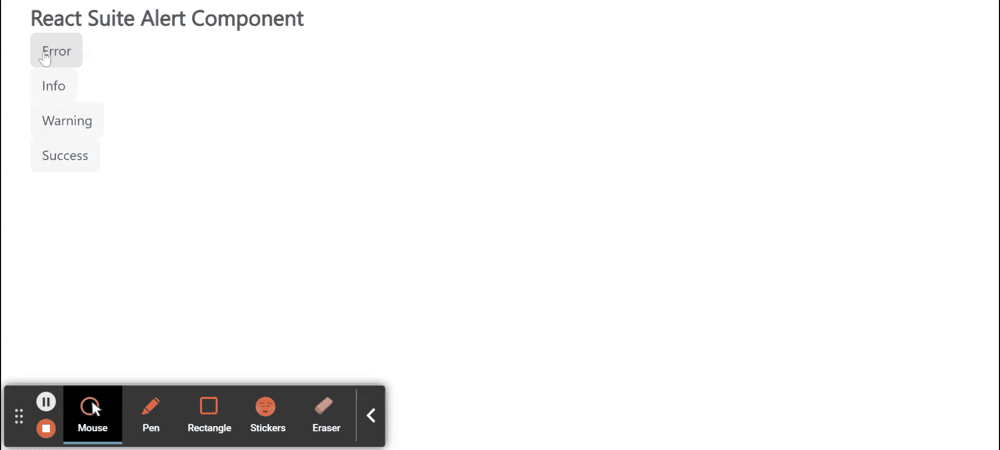

# 反应套件警报组件

> 原文:[https://www.geeksforgeeks.org/react-suite-alert-component/](https://www.geeksforgeeks.org/react-suite-alert-component/)

React Suite 是一个流行的前端库，包含一组为中间平台和后端产品设计的 React 组件。警报组件用于紧急中断，需要确认，通知用户情况。我们可以在 ReactJS 中使用以下方法来使用 React Suite 警报组件。

**预警方式:**

*   **Alert.info:** 此方法用于信息提醒。
*   **Alert.success:** 此方法用于成功信息提醒。
*   **Alert.warning:** 此方法用于警告消息。
*   **Alert.error:** 此方法用于错误消息。
*   **Alert.close:** 此方法用于关闭消息。
*   **Alert.closeAll:** 此方法用于关闭所有消息。
*   **Alert.config:** 此方法用于设置全局配置。

**方法道具:**

这些道具用于信息、成功、警告和错误方法:

*   **内容:**用于表示告警的内容。
*   **持续时间:**用于表示显示的持续时间，持续时间结束后自动关闭提醒框。
*   **onClose:** 是关闭 Alert 时触发的回调函数。

这些道具用于配置方法:

*   **顶部:**用于表示离页面顶部的距离。
*   **持续时间:**用于表示报警持续时间。
*   **getContainer:** 用于表示 Alert 的父容器。

**创建反应应用程序并安装模块:**

*   **步骤 1:** 使用以下命令创建一个反应应用程序:

    ```
    npx create-react-app foldername
    ```

*   **步骤 2:** 在创建项目文件夹(即文件夹名**)后，使用以下命令将**移动到该文件夹:

    ```
    cd foldername
    ```

*   **步骤 3:** 创建 ReactJS 应用程序后，使用以下命令安装所需的****模块:****

    ```
    **npm install rsuite**
    ```

******项目结构:**如下图。****

****

项目结构**** 

******示例:**现在在 **App.js** 文件中写下以下代码。在这里，App 是我们编写代码的默认组件。****

## ****App.js****

```
**import React from 'react'
import 'rsuite/dist/styles/rsuite-default.css';
import { Button, Alert } from 'rsuite'

export default function App() {
  return (
    <div style={{
      display: 'block', width: 700, paddingLeft: 30
    }}>
      <h4>React Suite Alert Component</h4>
      <Button onClick={() => Alert.error('Error Alert')}>
        Error 
      </Button></br>
      <Button onClick={() => Alert.info('Information Alert')}>
        Info 
      </Button></br>
      <Button onClick={() => Alert.warning('Warning Alert')}>
        Warning 
      </Button></br>
      <Button onClick={() => Alert.success('Success Alert')}> 
        Success 
      </Button>
    </div>
  );
}**
```

******运行应用程序的步骤:**从项目的根目录使用以下命令运行应用程序:****

```
**npm start**
```

******输出:**现在打开浏览器，转到***http://localhost:3000/***，会看到如下输出:****

********

******参考:**T2】https://rsuitejs.com/components/alert/****