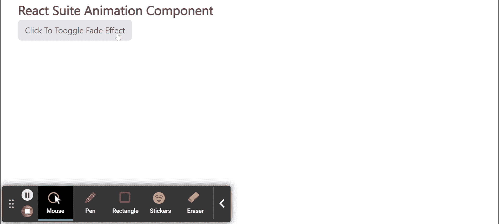

# 反应套件动画组件

> 原文:[https://www . geesforgeks . org/react-suite-animation-component/](https://www.geeksforgeeks.org/react-suite-animation-component/)

React Suite 是一个流行的前端库，包含一组为中间平台和后端产品设计的 React 组件。动画  组件允许用户操作动画组件。它提供各种动画像淡入淡出、弹跳、滑动、折叠、和过渡效果。我们可以在 ReactJS 中使用以下方法来使用 React Suite 动画组件。

**消退道具:**

*   **输入类名:**用于组件完成转入后添加类名。
*   **输入类名:**用于在组件开始转换时添加类名。
*   **existedclassname:**用于组件完成转出后添加类名。
*   **exitingClassName:** 用于在组件开始向外过渡时添加类名。
*   中的**当设置为真时，动画将自动显示。**
*   **onEnter:** 是组件转入之前触发的回调函数。
*   **OneHinded:**是组件完成转换后触发的回调函数。
*   **OnLining:**是一个回调函数，当组件开始转入时触发。
*   **onExit:** 它是一个回调函数，就在组件转换出来之前被触发。
*   **onexitted:**它是一个回调函数，在 Modal 完成转换后被触发。
*   **onExiting:** 是一个回调函数，在组件开始向外过渡时触发。
*   **超时:**用于表示动画过渡延迟时间。
*   **转场面板:**用于在初始显示时打开转场。
*   **卸载退出:**用于在退出时卸载组件。

**塌陷道具:**

*   **尺寸:**用于设置折叠尺寸类型。
*   **输入类名:**用于组件完成转入后添加类名。
*   **输入类名:**用于在组件开始转换时添加类名。
*   **existedclassname:**用于组件完成转出后添加类名。
*   **exitingClassName:** 用于在组件开始向外过渡时添加类名。
*   **getDimensionValue:** 是获取自定义尺寸值的函数。
*   中的**当设置为真时，动画将自动显示。**
*   **onEnter:** 是组件转入之前触发的回调函数。
*   **OneHinded:**是组件完成转换后触发的回调函数。
*   **OnLining:**是一个回调函数，当组件开始转入时触发。
*   **onExit:** 它是一个回调函数，就在组件转换出来之前被触发。
*   **onexitted:**它是一个回调函数，在 Modal 完成转换后被触发。
*   **onExiting:** 是一个回调函数，在组件开始向外过渡时触发。
*   **角色:**用于表示 HTML 角色属性。
*   **超时:**用于表示动画过渡延迟时间。
*   **转场面板:**用于在初始显示时打开转场。
*   **卸载退出:**用于在退出时卸载组件。

**弹跳道具:**

*   **输入类名:**用于组件完成转入后添加类名。
*   **输入类名:**用于在组件开始转换时添加类名。
*   **existedclassname:**用于组件完成转出后添加类名。
*   **exitingClassName:** 用于在组件开始向外过渡时添加类名。
*   中的**当设置为真时，动画将自动显示。**
*   **onEnter:** 是组件转入之前触发的回调函数。
*   **OneHinded:**是组件完成转换后触发的回调函数。
*   **OnLining:**是一个回调函数，当组件开始转入时触发。
*   **onExit:** 它是一个回调函数，就在组件转换出来之前被触发。
*   **onexitted:**它是一个回调函数，在 Modal 完成转换后被触发。
*   **onExiting:** 是一个回调函数，在组件开始向外过渡时触发。
*   **超时:**用于表示动画过渡延迟时间。
*   **转场面板:**用于在初始显示时打开转场。
*   **卸载退出:**用于在退出时卸载组件。

**滑行道具:**

*   **输入类名:**用于组件完成转入后添加类名。
*   **输入类名:**用于在组件开始转换时添加类名。
*   **existedclassname:**用于组件完成转出后添加类名。
*   **exitingClassName:** 用于在组件开始向外过渡时添加类名。
*   中的**当设置为真时，动画将自动显示。**
*   **onEnter:** 是组件转入之前触发的回调函数。
*   **OneHinded:**是组件完成转换后触发的回调函数。
*   **OnLining:**是一个回调函数，当组件开始转入时触发。
*   **onExit:** 它是一个回调函数，就在组件转换出来之前被触发。
*   **onexitted:**它是一个回调函数，在 Modal 完成转换后被触发。
*   **onExiting:** 是一个回调函数，在组件开始向外过渡时触发。
*   **超时:**用于表示动画过渡延迟时间。
*   **转场面板:**用于在初始显示时打开转场。
*   **卸载退出:**用于在退出时卸载组件。
*   **放置:**用于组件的放置。

**过渡道具:**

*   **输入类名:**用于组件完成转入后添加类名。
*   **输入类名:**用于在组件开始转换时添加类名。
*   **existedclassname:**用于组件完成转出后添加类名。
*   **exitingClassName:** 用于在组件开始向外过渡时添加类名。
*   中的**当设置为真时，动画将自动显示。**
*   **onEnter:** 是组件转入之前触发的回调函数。
*   **OneHinded:**是组件完成转换后触发的回调函数。
*   **OnLining:**是一个回调函数，当组件开始转入时触发。
*   **onExit:** 它是一个回调函数，就在组件转换出来之前被触发。
*   **onexitted:**它是一个回调函数，在 Modal 完成转换后被触发。
*   **onExiting:** 是一个回调函数，在组件开始向外过渡时触发。
*   **超时:**用于表示动画过渡延迟时间。
*   **转场面板:**用于在初始显示时打开转场。
*   **卸载退出:**用于在退出时卸载组件。

**创建反应应用程序并安装模块:**

*   **步骤 1:** 使用以下命令创建一个反应应用程序:

    ```
    npx create-react-app foldername
    ```

*   **步骤 2:** 在创建项目文件夹(即文件夹名**)后，使用以下命令将**移动到该文件夹:

    ```
    cd foldername
    ```

*   **步骤 3:** 创建 ReactJS 应用程序后，使用以下命令安装所需的****模块:****

    ```
    **npm install rsuite**
    ```

******项目结构:**如下图。****

****

项目结构**** 

******示例:**现在在 **App.js** 文件中写下以下代码。在这里，App 是我们编写代码的默认组件。****

## ****App.js****

```
**import React from 'react'
import 'rsuite/dist/styles/rsuite-default.css';
import { Animation, Button } from 'rsuite';
const { Fade } = Animation;

export default function App() {

  // State for show
  const [isShow, setIsShow] = React.useState(false)

  return (
    <div style={{
      display: 'block', width: 700, paddingLeft: 30
    }}>
      <h4>React Suite Animation Component</h4>
      <Button onClick={() => {
        setIsShow(!isShow)
      }}>
        Click To Toggle Fade Effect</Button>
      <Fade in={isShow}>
        {(props, ref) => (
          <div
            {...props}
            ref={ref}
            style={{
              width: 200,
              height: 200,
              background: 'green',
              overflow: 'hidden'
            }} >
            <p>Sample Panel Content!</p>

          </div>
        )}
      </Fade>
    </div >
  );
}**
```

******运行应用程序的步骤:**从项目的根目录使用以下命令运行应用程序:****

```
**npm start**
```

******输出:**现在打开浏览器，转到***http://localhost:3000/***，会看到如下输出:****

********

******参考:**T2】https://rsuitejs.com/components/animation/****