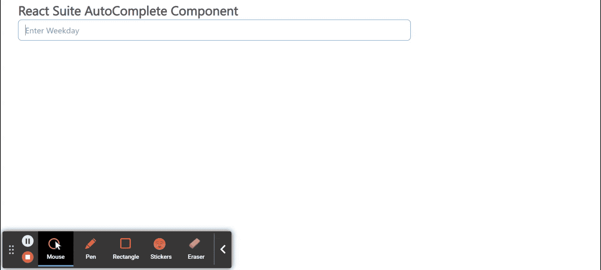

# 反应套件自动完成组件

> 原文:[https://www . geesforgeks . org/react-suite-autocomplete-component/](https://www.geeksforgeeks.org/react-suite-autocomplete-component/)

React Suite 是一个流行的前端库，包含一组为中间平台和后端产品设计的 React 组件。自动完成  组件允许用户使用选项值自动完成自由文本值。我们可以在 ReactJS 中使用以下方法来使用 React Suite 自动完成组件。

**自动完成道具:**

*   **类前缀:**用于表示组件 CSS 类的前缀。
*   **数据:**用于表示部件的数据。
*   **默认值:**用于表示默认值。
*   **禁用:**表示是否禁用选择。
*   **筛选依据:**用于自定义筛选规则。
*   **菜单类名:**用于表示应用于菜单 DOM 的 CSS 类。
*   **onChange:** 是选择一个选项或输入值发生变化或输入值发生变化时触发的回调函数。
*   **onClose:** 是隐藏时触发的回调函数。
*   **onEnter:** 是一个回调函数，在叠加转换之前触发。
*   **OneHinded:**这是一个回调函数，在覆盖完成转换后触发。
*   **OnLining:**这是一个回调函数，当覆盖开始转换时被触发。
*   **onExit:** 它是一个回调函数，在覆盖转换之前被触发。
*   **onexitted:**是一个回调函数，在覆盖完成转换后触发。
*   **onExiting:** 是一个回调函数，在叠加开始向外过渡时触发。
*   **onSelect** :是选择一个选项时触发的回调函数。
*   **占位符:**表示输入的占位符。
*   **渲染项目:**用于自定义选择的选项。
*   **选择输入键:**当设置为假时，回车键选择功能无效。
*   **值:**用于表示值(受控)。

**创建反应应用程序并安装模块:**

*   **步骤 1:** 使用以下命令创建一个反应应用程序:

    ```jsx
    npx create-react-app foldername
    ```

*   **步骤 2:** 创建项目文件夹(即文件夹名**)后，使用以下命令移动到该文件夹中:**

    ```jsx
    cd foldername
    ```

*   **步骤 3:** 创建 ReactJS 应用程序后，使用以下命令安装所需的****模块:****

    ```jsx
    **npm install rsuite**
    ```

******项目结构:**如下图。****

****

项目结构**** 

******示例:**现在在 **App.js** 文件中写下以下代码。在这里，App 是我们编写代码的默认组件。****

## ****App.js****

```jsx
**import React from 'react'
import 'rsuite/dist/styles/rsuite-default.css';
import { AutoComplete } from 'rsuite';

export default function App() {

  // Sample options for our Autocomplete
  const options = ['Monday', 'Tuesday', 'Wednesday', 'Thursday',
    'Friday', 'Saturday', 'Sunday']

  return (
    <div style={{
      display: 'block', width: 700, paddingLeft: 30
    }}>
      <h4>React Suite AutoComplete Component</h4>
      <AutoComplete placeholder="Enter Weekday" data={options} />
    </div>
  );
}**
```

******运行应用程序的步骤:**从项目的根目录使用以下命令运行应用程序:****

```jsx
**npm start**
```

******输出:**现在打开浏览器，转到***http://localhost:3000/***，会看到如下输出:****

********

******参考:**T2】https://rsuitejs.com/components/auto-complete/****