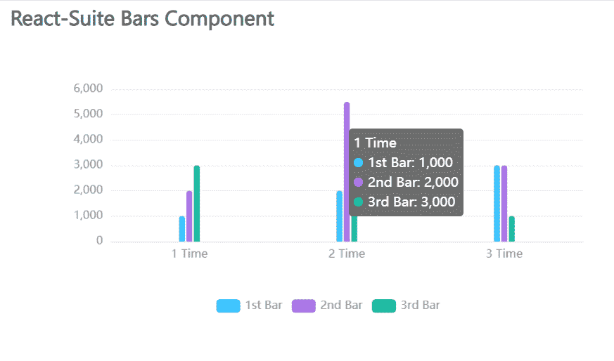

# 反应套件条组件

> 原文:[https://www.geeksforgeeks.org/react-suite-bars-component/](https://www.geeksforgeeks.org/react-suite-bars-component/)

React Suite Charts 是一个流行的前端库，包含一组 React 组件，用于提供一组基于 rsuite 和 echarts 的图表。条形  组件允许用户将条形添加到我们的图形中。它有助于在我们的图表中添加多个条形。我们可以在 ReactJS 中使用以下方法来使用 React Suite Bars 组件。

**酒吧道具:**

*   **名称:**用于表示酒吧的名称。

**创建反应应用程序并安装模块:**

*   **步骤 1:** 使用以下命令创建一个反应应用程序:

    ```jsx
    npx create-react-app foldername
    ```

*   **步骤 2:** 创建项目文件夹(即文件夹名**)后，使用以下命令移动到该文件夹中:**

    ```jsx
    cd foldername
    ```

*   **步骤 3:** 创建 ReactJS 应用程序后，使用以下命令安装所需的****模块:****

    ```jsx
    **npm install @rsuite/charts**
    ```

******项目结构:**如下图。****

****

项目结构**** 

******示例:**现在在 **App.js** 文件中写下以下代码。在这里，App 是我们编写代码的默认组件。****

## ****App.js****

```jsx
**import React from 'react'
import 'rsuite/dist/styles/rsuite-default.css';
import { BarChart, Bars } from '@rsuite/charts';

export default function App() {

  // Sample data
  const sampleData = [
    ['1 Time', 1000, 2000, 3000],
    ['2 Time', 2000, 5500, 2400],
    ['3 Time', 3000, 3000, 1000]
  ];

  return (
    <div style={{
      display: 'block', width: 700, paddingLeft: 30
    }}>
      <h4>React-Suite Bars Component</h4>
      <BarChart name="BarChart" data={sampleData} >
        <Bars name="1st Bar" />
        <Bars name="2nd Bar" />
        <Bars name="3rd Bar" />
      </BarChart>
    </div >
  );
}**
```

******运行应用程序的步骤:**从项目的根目录使用以下命令运行应用程序:****

```jsx
**npm start**
```

******输出:**现在打开浏览器，转到***http://localhost:3000/***，会看到如下输出:****

********

******参考:**T2】https://charts.rsuitejs.com/****