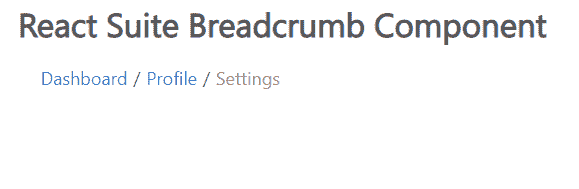

# 反应套件面包屑组件

> 原文:[https://www . geeksforgeeks . org/react-suite-bread scrum-component/](https://www.geeksforgeeks.org/react-suite-breadscrum-component/)

React Suite 是一个流行的前端库，包含一组为中间平台和后端产品设计的 React 组件。面包屑管理  组件允许用户在导航层次结构中显示当前页面路径。我们可以在 ReactJS 中使用下面的方法来使用 React Suite 面包圈组件。

**面包屑道具**

*   **类前缀:**用于表示组件 CSS 类的前缀。
*   **maxItems:** 用于设置要显示的最大面包屑数量。
*   **onExpand:** 是当你在折叠视图中点击省略号时触发的功能。
*   **分隔符:**用于自定义分隔符。

**面包屑。物品道具**

*   **激活:**用于表示激活状态。
*   **componentClass:** 用于该组件的自定义元素。
*   **渲染项:**用于自定义渲染项。

**创建反应应用程序并安装模块:**

*   **步骤 1:** 使用以下命令创建一个反应应用程序:

    ```
    npx create-react-app foldername
    ```

*   **步骤 2:** 在创建项目文件夹(即文件夹名**)后，使用以下命令将**移动到该文件夹:

    ```
    cd foldername
    ```

*   **步骤 3:** 创建 ReactJS 应用程序后，使用以下命令安装所需的****模块:****

    ```
    **npm install rsuite**
    ```

******项目结构:**如下图。****

****

项目结构**** 

******示例:**现在在 **App.js** 文件中写下以下代码。在这里，App 是我们编写代码的默认组件。****

## ****App.js****

```
**import React from 'react'
import 'rsuite/dist/styles/rsuite-default.css';
import { Breadcrumb } from 'rsuite'

export default function App() {

  return (
    <div style={{
      display: 'block', width: 700, paddingLeft: 30
    }}>
      <h4>React Suite Breadcrumb Component</h4>
      <Breadcrumb>
        <Breadcrumb.Item>Dashboard</Breadcrumb.Item>
        <Breadcrumb.Item>Profile</Breadcrumb.Item>
        <Breadcrumb.Item active>Settings</Breadcrumb.Item>
      </Breadcrumb>
    </div>
  );
}**
```

******运行应用程序的步骤:**从项目的根目录使用以下命令运行应用程序:****

```
**npm start**
```

******输出:**现在打开浏览器，转到***http://localhost:3000/***，会看到如下输出:****

********

******参考:**T2】https://rsuitejs.com/components/breadcrumb/****