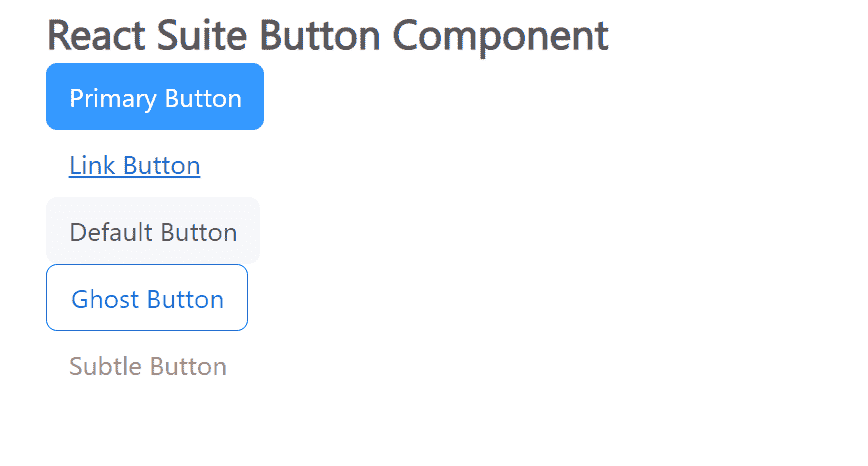

# 反应套件按钮组件

> 原文:[https://www.geeksforgeeks.org/react-suite-button-component/](https://www.geeksforgeeks.org/react-suite-button-component/)

React Suite 是一个流行的前端库，包含一组为中间平台和后端产品设计的 React 组件。按钮组件允许用户通过一次点击来采取行动和做出选择。我们可以在 ReactJS 中使用以下方法来使用 React Suite 按钮组件。

**按钮道具:**

*   **激活:**用于将按钮状态变为激活。
*   **外观:**用于表示按钮的外观。
*   **块:**用于跨越 Button 父项的整个宽度。
*   **儿童:**表示主要内容。
*   **类前缀:**用于表示组件 CSS 类的前缀。
*   **颜色:**用于表示按钮的颜色。
*   **componentClass:** 用于传递该组件的自定义元素。
*   **禁用:**用于将按钮状态更改为禁用。
*   **href:** 用于提供 *href* 属性。
*   **装载:**用于显示装载指示器。
*   **大小:**用于表示按钮的大小。

图标按钮提议:

*   **圆圈:**用于设置圆圈按钮。
*   **类前缀:**用于表示组件 CSS 类的前缀。
*   **图标:**用于设置按钮的图标。
*   **放置:**用于图标的放置。

按钮组提议:

*   **块:**用于显示块按钮组。
*   **类前缀:**用于表示组件 CSS 类的前缀。
*   **对齐:**用于水平等宽布局
*   **大小:**用于表示按钮的大小。
*   **垂直:**用于按钮的垂直布局

**创建反应应用程序并安装模块:**

*   **步骤 1:** 使用以下命令创建一个反应应用程序:

    ```
    npx create-react-app foldername
    ```

*   **步骤 2:** 在创建项目文件夹(即文件夹名**)后，使用以下命令将**移动到该文件夹:

    ```
    cd foldername
    ```

*   **步骤 3:** 创建 ReactJS 应用程序后，使用以下命令安装所需的****模块:****

    ```
    **npm install rsuite**
    ```

******项目结构:**如下图。****

****

项目结构**** 

******示例:**现在在 **App.js** 文件中写下以下代码。在这里，App 是我们编写代码的默认组件。****

## ****App.js****

```
**import React from 'react'
import 'rsuite/dist/styles/rsuite-default.css';
import { Button } from 'rsuite'

export default function App() {
  return (
    <div style={{
      display: 'block', width: 700, paddingLeft: 30
    }}>
      <h4>React Suite Button Component</h4>
      <Button appearance="primary">Primary Button</Button>  <br></br>
      <Button appearance="link">Link Button</Button> <br></br>
      <Button appearance="default">Default Button</Button> <br></br>
      <Button appearance="ghost">Ghost Button</Button> <br></br>
      <Button appearance="subtle">Subtle Button</Button>
    </div>
  );
}**
```

******运行应用程序的步骤:**从项目的根目录使用以下命令运行应用程序:****

```
**npm start**
```

******输出:**现在打开浏览器，转到***http://localhost:3000/***，会看到如下输出:****

********

******参考:**T2】https://rsuitejs.com/components/button/****