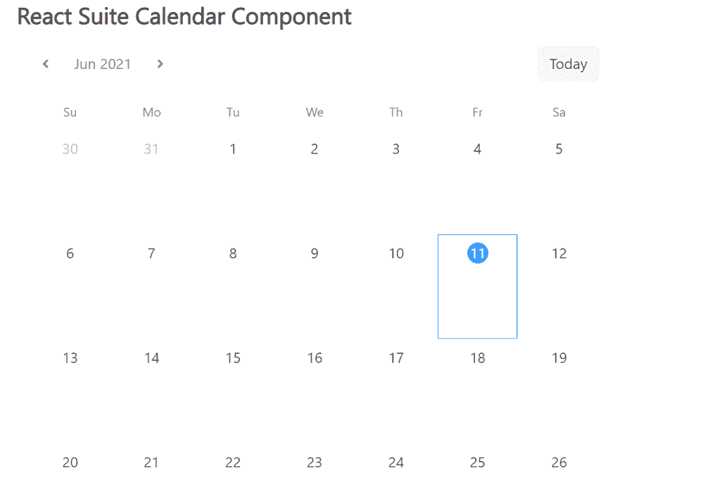

# 反应套件日历组件

> 原文:[https://www . geesforgeks . org/react-suite-calendar-component/](https://www.geeksforgeeks.org/react-suite-calendar-component/)

React Suite 是一个流行的前端库，包含一组为中间平台和后端产品设计的 React 组件。日历  组件允许用户通过日历显示数据。它被视为 以一日历的形式显示数据的容器。 我们可以在 ReactJS 中使用以下方法来使用 React Suite 日历组件。

**日历道具:**

*   **加边框:**用于显示边框。
*   **紧凑:**用于显示紧凑的日历。
*   **默认值:**用于表示默认值。
*   **等周:**表示 ISO 8601 标准是否启用。
*   **onChange:** 是值改变前触发的回调函数。
*   **onSelect:** 是在选择的日期之前触发的回调函数。
*   **渲染单元:**用于自定义渲染日历单元。
*   **值:**用于表示受控值。

**创建反应应用程序并安装模块:**

*   **步骤 1:** 使用以下命令创建一个反应应用程序:

    ```jsx
    npx create-react-app foldername
    ```

*   **步骤 2:** 在创建项目文件夹(即文件夹名**)后，使用以下命令将**移动到该文件夹:

    ```jsx
    cd foldername
    ```

*   **步骤 3:** 创建 ReactJS 应用程序后，使用以下命令安装所需的****模块:****

    ```jsx
    **npm install rsuite**
    ```

******项目结构:**如下图。****

****

项目结构**** 

******示例:**现在在 **App.js** 文件中写下以下代码。在这里，App 是我们编写代码的默认组件。****

## ****App.js****

```jsx
**import React from 'react'
import 'rsuite/dist/styles/rsuite-default.css';
import { Calendar } from 'rsuite';

export default function App() {

  return (
    <div style={{
      display: 'block', width: 600, paddingLeft: 30
    }}>
      <h4>React Suite Calendar Component</h4>
      <Calendar />
    </div>
  );
}**
```

******运行应用程序的步骤:**从项目的根目录使用以下命令运行应用程序:****

```jsx
**npm start**
```

******输出:**现在打开浏览器，转到***http://localhost:3000/***，会看到如下输出:****

********

******参考:**T2】https://rsuitejs.com/components/calendar/****