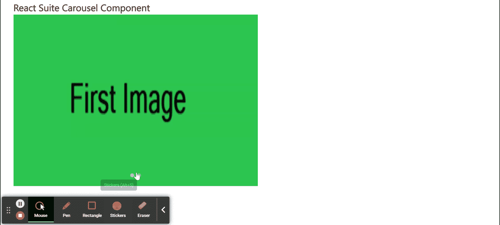

# 反应套件转盘组件

> 原文:[https://www . geesforgeks . org/react-suite-carousel-component/](https://www.geeksforgeeks.org/react-suite-carousel-component/)

React Suite 是一个流行的前端库，包含一组为中间平台和后端产品设计的 React 组件。转盘  组件允许用户在转盘中放置一组元素。我们可以在 ReactJS 中使用以下方法来使用 React Suite 转盘组件。

**转盘道具:**

*   **自动播放:**用于自动转盘元素。
*   **自动播放间隔:**用于表示导航到下一个项目之前的延迟时间，单位为毫秒。
*   **子元素:**用于表示转盘元素。
*   **类前缀:**用于表示组件 CSS 类前缀。
*   **componentClass:** 用于自定义元素类型。
*   **放置:**用于按钮放置。
*   **形状:**用于表示按钮形状。

**创建反应应用程序并安装模块:**

*   **步骤 1:** 使用以下命令创建一个反应应用程序:

    ```
    npx create-react-app foldername
    ```

*   **步骤 2:** 创建项目文件夹(即文件夹名**)后，使用以下命令移动到该文件夹中:**

    ```
    cd foldername
    ```

*   **步骤 3:** 创建 ReactJS 应用程序后，使用以下命令安装所需的****模块:****

    ```
    **npm install rsuite**
    ```

******项目结构:**如下图。****

****

项目结构**** 

******示例:**现在在 **App.js** 文件中写下以下代码。在这里，App 是我们编写代码的默认组件。****

## ****App.js****

```
**import React from 'react'
import 'rsuite/dist/styles/rsuite-default.css';
import { Carousel } from 'rsuite';

export default function App() {

  return (
    <div style={{
      display: 'block', width: 600, paddingLeft: 30
    }}>
      <h4>React Suite Carousel Component</h4>
      <Carousel className="custom-slider">
        
        
      </Carousel>
    </div>
  );
}**
```

******运行应用程序的步骤:**从项目的根目录使用以下命令运行应用程序:****

```
**npm start**
```

******输出:**现在打开浏览器，转到***http://localhost:3000/***，会看到如下输出:****

********

******参考:**T2】https://rsuitejs.com/components/carousel/****