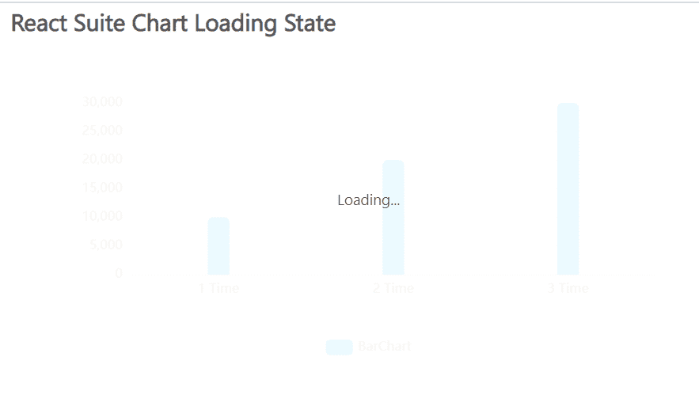

# 反应套件图表加载状态

> 原文:[https://www . geesforgeks . org/react-suite-chart-loading-state/](https://www.geeksforgeeks.org/react-suite-chart-loading-state/)

React Suite Charts 是一个流行的前端库，包含一组 React 组件，用于提供一组基于 rsuite 和 echarts 的图表。加载状态很重要，表示图形是否处于加载状态。

我们可以在 ReactJS 中使用以下方法来使用加载状态。这里，我们使用条形图来演示加载状态。*加载*道具帮助我们确定图形的加载状态。

**条形图道具：**

*   **名称:**用于表示图形的名称。
*   **数据:**用于传递图形的数据。
*   **加载:**用于指示图形是否处于加载状态。如果为真，则图表将显示为加载状态。

**创建反应应用程序并安装模块:**

*   **步骤 1:** 使用以下命令创建一个反应应用程序:

    ```jsx
    npx create-react-app foldername
    ```

*   **步骤 2:** 在创建项目文件夹(即文件夹名**)后，使用以下命令将**移动到该文件夹:

    ```jsx
    cd foldername
    ```

*   **步骤 3:** 创建 ReactJS 应用程序后，使用以下命令安装所需的****模块:****

    ```jsx
    **npm install @rsuite/charts**
    ```

******项目结构:**如下图。****

****

项目结构**** 

******示例:**现在在 **App.js** 文件中写下以下代码。在这里，App 是我们编写代码的默认组件。****

## ****App.js****

```jsx
**import React from 'react'
import 'rsuite/dist/styles/rsuite-default.css';
import { BarChart } from '@rsuite/charts';

export default function App() {

  // Sample data
  const sampleData = [
    ['1 Time', 10000],
    ['2 Time', 20000],
    ['3 Time', 30000],
  ];

  return (
    <div style={{
      display: 'block', width: 700, paddingLeft: 30
    }}>
      <h4>React Suite Chart Loading State</h4>
      <BarChart loading={true} name="BarChart" data={sampleData} />
    </div >
  );
}**
```

******运行应用程序的步骤:**从项目的根目录使用以下命令运行应用程序:****

```jsx
**npm start**
```

******输出:**现在打开浏览器，转到***http://localhost:3000/***，会看到如下输出:****

********

******参考:**[https://charts . rsejos . com/# %和 5% 8a %至 0%和 8% BD %和 4% b8 %至](https://charts.rsuitejs.com/#%E5%8A%A0%E8%BD%BD%E4%B8%AD)****