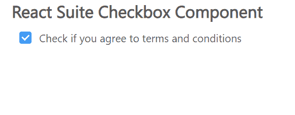

# 反应套件复选框组件

> 原文:[https://www . geesforgeks . org/react-suite-checkbox-component/](https://www.geeksforgeeks.org/react-suite-checkbox-component/)

React Suite 是一个流行的前端库，包含一组为中间平台和后端产品设计的 React 组件。复选框  组件允许用户从给定选项中进行二进制选择。我们可以在 ReactJS 中使用以下方法来使用 React Suite Checkbox 组件。

**复选框道具:**

*   **选中:**表示复选框是否被选中。
*   **默认选中:**用于指定复选框是否被选中的初始状态。
*   **禁用:**用于在设置为真时禁用复选框。
*   **id:** 用于表示复选框的通用 id 属性。
*   **不确定:**用于表示复选框的不确定选中状态。
*   **内联:**用于内联布局。
*   **inputRef:** 用于表示输入元素的 Ref。
*   **名称:**用于表示复选框的名称属性。
*   **onChange:** 是状态变化时触发的回调函数。
*   **标题:**用来表示 HTML 标题。
*   **值:**用于表示 CheckboxGroup 的值。

**CheckboxGroup 道具:**

*   **默认值:**用于表示默认值。
*   **内联:**用于内联布局。
*   **名称:**用于表示复选框的名称属性。
*   **onChange:** 是状态变化时触发的回调函数。
*   **值:**用于表示复选框(受控)的值。

**创建反应应用程序并安装模块:**

*   **步骤 1:** 使用以下命令创建一个反应应用程序:

    ```jsx
    npx create-react-app foldername
    ```

*   **步骤 2:** 创建项目文件夹(即文件夹名**)后，使用以下命令移动到该文件夹中:**

    ```jsx
    cd foldername
    ```

*   **步骤 3:** 创建 ReactJS 应用程序后，使用以下命令安装所需的****模块:****

    ```jsx
    **npm install rsuite**
    ```

******项目结构:**如下图。****

****

项目结构**** 

******示例:**现在在 **App.js** 文件中写下以下代码。在这里，App 是我们编写代码的默认组件。****

## ****App.js****

```jsx
**import React from 'react'
import 'rsuite/dist/styles/rsuite-default.css';
import { Checkbox } from 'rsuite';

export default function App() {

  return (
    <div style={{
      display: 'block', width: 700, paddingLeft: 30
    }}>
      <h4>React Suite Checkbox Component</h4>
      <Checkbox defaultChecked>
        Check if you agree to terms and conditions
      </Checkbox>
    </div>
  );
}**
```

******运行应用程序的步骤:**从项目的根目录使用以下命令运行应用程序:****

```jsx
**npm start**
```

******输出:**现在打开浏览器，转到***http://localhost:3000/***，会看到如下输出:****

********

******参考:**T2】https://rsuitejs.com/components/checkbox/****