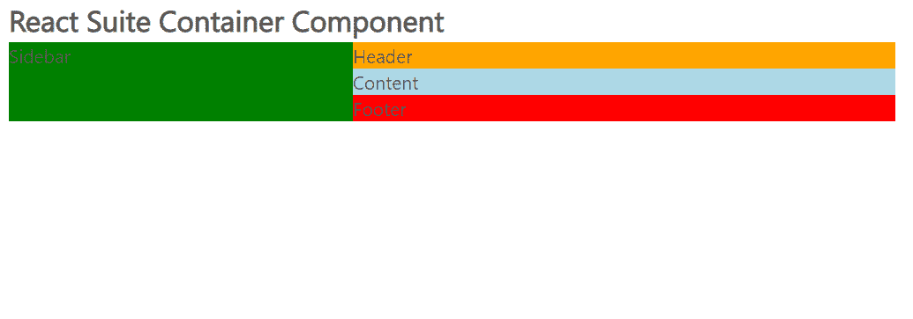

# 反应套件容器组件

> 原文:[https://www . geesforgeks . org/react-suite-container-component/](https://www.geeksforgeeks.org/react-suite-container-component/)

React Suite 是一个流行的前端库，包含一组为中间平台和后端产品设计的 React 组件。容器  组件允许用户定义布局，该布局可以定义页面的主框架。  我们可以在 ReactJS 中使用以下方法来使用 React Suite 容器组件。

**集装箱布局:**

*   **容器:**表示用于布局的容器。
*   **表头:**用于表示容器表头。
*   **内容:**用于表示容器内容物。
*   **页脚:**用于表示容器页脚。
*   **侧边栏:**用来表示容器侧边栏。

**创建反应应用程序并安装模块:**

*   **步骤 1:** 使用以下命令创建一个反应应用程序:

    ```jsx
    npx create-react-app foldername
    ```

*   **步骤 2:** 在创建项目文件夹(即文件夹名**)后，使用以下命令将**移动到该文件夹:

    ```jsx
    cd foldername
    ```

*   **步骤 3:** 创建 ReactJS 应用程序后，使用以下命令安装所需的****模块:****

    ```jsx
    **npm install rsuite**
    ```

******项目结构:**如下图。****

****

项目结构**** 

******示例:**现在在 **App.js** 文件中写下以下代码。在这里，App 是我们编写代码的默认组件。****

## ****App.js****

```jsx
**import React from 'react'
import 'rsuite/dist/styles/rsuite-default.css';
import { Container, Header, Content, Footer, Sidebar } from 'rsuite';

export default function App() {

  return (
    <div style={{
      display: 'block', width: 700, paddingLeft: 30
    }}>
      <h4>React Suite Container Component</h4>
      <Container>
        <Sidebar style={{ backgroundColor: 'green' }}>
          Sidebar
        </Sidebar>
        <Container>
          <Header style={{ backgroundColor: 'orange' }}>
            Header
          </Header>
          <Content style={{ backgroundColor: 'lightblue' }}>
            Content
          </Content>
          <Footer style={{ backgroundColor: 'red' }}>
            Footer
          </Footer>
        </Container>
      </Container>
    </div>
  );
}**
```

******运行应用程序的步骤:**从项目的根目录使用以下命令运行应用程序:****

```jsx
**npm start**
```

******输出:**现在打开浏览器，转到***http://localhost:3000/***，会看到如下输出:****

********

******参考:**T2】https://rsuitejs.com/components/container/****