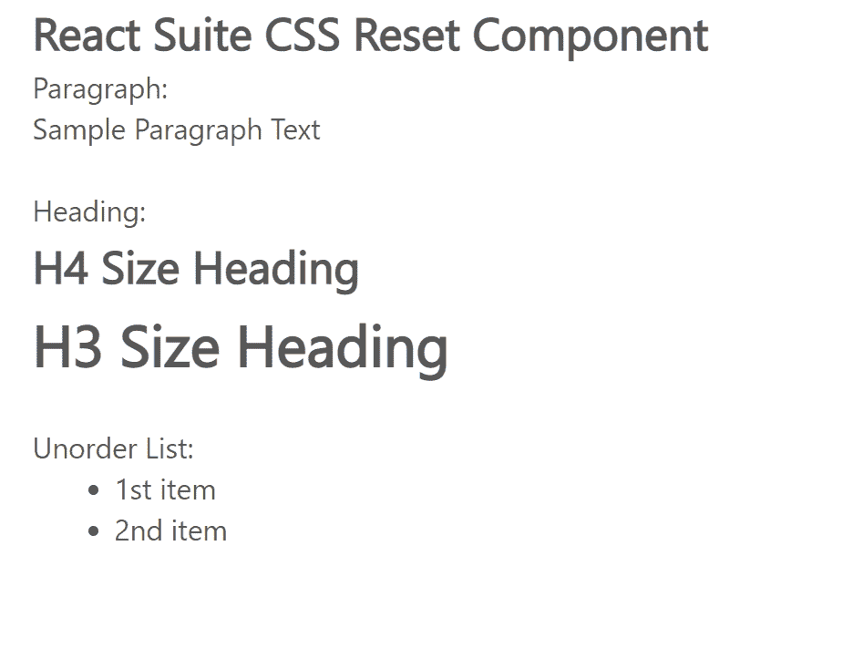

# 反应套件 CSS 重置组件

> 原文:[https://www . geesforgeks . org/react-suite-CSS-reset-component/](https://www.geeksforgeeks.org/react-suite-css-reset-component/)

React Suite 是一个流行的前端库，包含一组为中间平台和后端产品设计的 React 组件。CSS Reset 组件是添加了样式的 HTML 元素，它帮助用户使用带有增强样式的 HTML 元素，如标题、段落等标签。我们可以在 ReactJS 中使用以下方法来使用 React Suite CSS 重置组件。

**元素:**

*   **<一> :** 是锚元素。
*   **< h1 >到< h6 > :** 是 HTML 节标题元素。
*   **< p > :** 是段落元素。
*   **< ul > :** 是无序列表元素。
*   **< ol > :** 是有序列表元素。
*   **< dl > :** 是描述列表元素。

**创建反应应用程序并安装模块:**

*   **步骤 1:** 使用以下命令创建一个反应应用程序:

    ```
    npx create-react-app foldername
    ```

*   **步骤 2:** 在创建项目文件夹(即文件夹名**)后，使用以下命令将**移动到该文件夹:

    ```
    cd foldername
    ```

*   **步骤 3:** 创建 ReactJS 应用程序后，使用以下命令安装所需的****模块:****

    ```
    **npm install rsuite**
    ```

******项目结构:**如下图。****

****

项目结构**** 

******示例:**现在在 **App.js** 文件中写下以下代码。在这里，App 是我们编写代码的默认组件。****

## ****App.js****

```
**import React from 'react'
import 'rsuite/dist/styles/rsuite-default.css';

export default function App() {

  return (
    <div style={{
      display: 'block', width: 700, paddingLeft: 30
    }}>
      <h4>React Suite CSS Reset Component</h4>
      Paragraph:
      <p> Sample Paragraph Text</p>
      </br>

      Heading:
      <h4>H4 Size Heading</h4>
      <h3>H3 Size Heading</h3> <br></br>

      Unorder List:
      <ul>
        <li>1st item</li>
        <li>2nd item</li>
      </ul> <br></br>
    </div >
  );
}**
```

******运行应用程序的步骤:**从项目的根目录使用以下命令运行应用程序:****

```
**npm start**
```

******输出:**现在打开浏览器，转到***http://localhost:3000/***，会看到如下输出:****

********

******参考:**T2】https://rsuitejs.com/components/css-reset/****